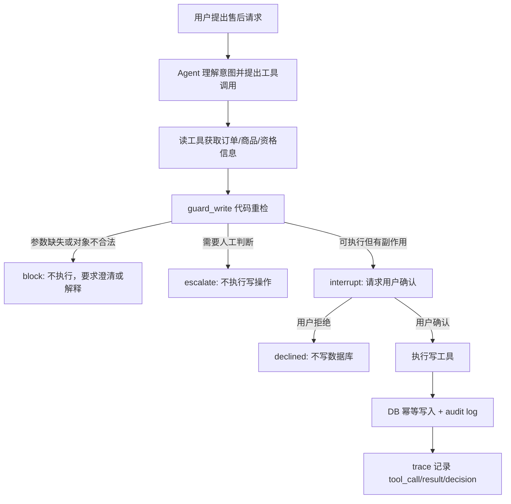

# 方向一：我是如何把 Agent 系统做得可控的

## 完整口述主线（可讲 5-7 分钟）

我在做 RetailCare Orchestrator 的时候，最核心的思考不是“怎么让模型回答得更像客服”，而是“怎么让一个会自主选择工具的 Agent 在业务系统里保持可控”。因为售后客服的特殊点在于，它不是纯问答。用户可能只是问订单状态，也可能要查物流、查优惠券、申请退换货、请求补偿、投诉升级。这里面既有低风险读操作，也有会改变业务状态的写操作。真正的风险不是某条政策本身复杂，而是 LLM Agent 在多轮对话里可能理解错、跳步骤、补错参数、重复调用工具，最后把一个语言层面的误解变成真实系统里的副作用。

所以我对“可控”的定义分成几层。第一，模型可以理解用户意图，但不能直接拥有业务执行权。第二，所有业务事实必须来自工具和数据库，不能来自模型编造。第三，所有副作用动作必须走统一的工程路径，不能因为模型在某轮对话里说“我已经确认了”就执行。第四，系统要能暂停、恢复、重试，但这些恢复和重试不能造成重复写入。第五，每一次工具调用、决策和异常都要能被 trace 回放，并且能进入评测系统。

架构上，我没有一上来做很多 Agent 角色，而是先做一个单 ReAct Agent 加 typed tool layer 的可控基线。这个 Agent 通过 LiteLLM 调模型，通过 LangGraph StateGraph 管理对话状态，工具层用 Pydantic 定义输入输出，并通过一个统一的 registry 暴露给 function calling 和 MCP server。这样做的好处是，模型看到的工具 schema、MCP 暴露的工具、实际 Python 实现是同一套定义，不会出现“Agent 以为工具这样用，服务端实现却是另一套”的问题。

然后我把工具按风险分层。读工具，比如查订单、查物流、查优惠券、检索政策、检查资格，都是无副作用的，可以让 Agent 自动调用。写工具，比如创建售后工单、发放补偿，就不能直接执行。它们在 LangGraph 的 `tools_node` 里会被统一拦截，先进入 `guard_write`。这里 guardrail 的价值不是写了某个简单阈值，而是把“模型提议动作”和“系统授权动作”分开。模型可以提出 `create_return_request`，但工程层会重新检查参数完整性、业务对象、资格状态、是否需要确认或人工处理，然后返回结构化的 `block`、`confirm`、`escalate` 或 `allow` 决策。

最关键的一点是，我把写操作设计成一个状态机，而不是一次工具调用。以普通售后写操作为例，用户提出请求后，Agent 先理解意图并读取必要信息；如果模型直接尝试写，工具节点也会先 guard；如果信息缺失，就 block 或要求澄清；如果是可执行但有副作用的动作，就触发 LangGraph `interrupt()`，让用户确认。确认前数据库没有任何写入。用户确认后，系统用同一个 `thread_id` resume，继续执行写工具。这个设计解决了两个问题：第一，模型不能单方面把副作用落库；第二，用户中途离开、刷新页面、第二天回来，都可以从 checkpoint 恢复，而不是重新开始一段不可控对话。

接下来是幂等。Agent 系统里一个很真实的工程问题是重复执行。用户可能说“刚才没看到结果，再帮我处理一次”；模型可能因为上下文长了忘记已经做过；工具失败恢复时也可能重跑节点。所以我没有把重复防护交给模型记忆，而是在工具和存储层做业务幂等。比如创建售后工单时，工具会按 `(order_id, item_id)` 查已有 ticket。如果同一个订单同一个商品已经创建过，哪怕这次传入了不同的 `idempotency_key`，系统也返回原来的 ticket，并标记 `deduped=True`，同时写 audit log。也就是说，最终防线是业务对象幂等，不是“希望模型记住”。

我还专门处理了恢复和故障场景。LangGraph checkpoint 解决的是“对话状态能不能回来”，但它不自动解决“恢复后副作用会不会重复”。所以我把 checkpoint 和 idempotency 组合起来：checkpoint 保证 conversation state 可恢复，idempotency 保证写动作重跑也只生效一次。工具调用外面还有 `call_with_recovery`，对 transient fault 做 bounded retry；如果重试后仍失败，会返回明确的降级信号，让 Agent 走人工处理，而不是在不确定状态下继续执行。

最后是可观察性。系统每一步都会写结构化 trace：用户消息、工具调用、工具结果、工具错误、guardrail decision、HITL interrupt、assistant reply。这个 trace 不只是为了 UI 看起来酷，而是作为评测和错误分类的输入。比如一次失败不是只看到“用户没满意”，而是能看到 Agent 有没有漏调用工具、有没有顺序错误、有没有执行 forbidden action、是不是缺参数没有澄清。这样可控性就从代码设计延伸到了持续评测。

结果上，L1 默认配置在 32 个售后任务、每个任务 3 次运行下，pass@1 是 0.9479，pass^3 是 0.875，policy violation rate 是 0，escalation precision 是 1.0。消融实验也证明了这套工程 hardening 的价值：不增加新 Agent，只从 L0 加到 L1，pass@1 从 0.633 提升到 0.80，工具选择错误从 11 降到 6；再加 RAG 后到 0.833，工具选择错误降到 5。我的结论是：这个项目的可控性不是来自某条业务规则，而是来自一套把模型、工具、状态、权限、恢复和评测分层的工程体系。

## STAR 完整讲法

### Situation

这个项目的业务场景是电商售后客服，用户会问订单、物流、优惠券，也会发起退换货、补偿、投诉升级。表面上看它是一个客服 Agent，但工程上最危险的地方不是“回答错一句话”，而是模型可能在多轮上下文中错误调用带副作用的工具，例如创建退款工单、发放补偿、重复执行同一个动作，或者在信息不完整时自作主张。

我一开始就把问题定义成“如何让 Agent 可控”，而不是“如何让 Prompt 更聪明”。因为 Prompt 可以降低错误概率，但不能作为最后一道防线。真正的可控性来自系统边界：哪些事情模型可以自己做，哪些事情必须被代码重检，哪些状态必须持久化，哪些动作必须被审计。

### Task

我的目标是把一个能聊天、能调工具的 Agent，工程化成一个可生产化解释的售后工作流。它要满足几个要求：读操作可以高效自动执行；写操作不能由模型单方面决定；同一个用户、订单、商品在多轮中不能被重复处理；用户中途离开后可以恢复；每一步动作都能被 trace 回放；如果模型或工具出错，系统要安全降级，而不是在不确定状态下继续执行。

这里有一个很关键的设计取舍：我没有一开始就堆很多 Agent 角色。当前 L1 版本是单 ReAct Agent 加 typed tool layer，再用 guardrails、HITL、RAG、checkpoint 和 eval 包住它。原因是我希望先建立一个可评测、可控制的基线，再用数据决定要不要拆 Refund Subgraph 或更多 specialist agent。这个选择本身体现了工程思维：先控制复杂度，再按错误分布演进架构。

### Action

第一层，我把“理解”和“执行”拆开。模型可以理解用户意图、选择工具、组织对话，但工具调用不是自由文本，而是统一走 `tools/registry.py` 里的 8 个工具定义。每个工具都有 Pydantic 输入输出契约，例如 `GetOrderIn`、`CheckReturnEligibilityIn`、`CreateReturnRequestIn`。同一个 registry 同时服务 Agent function calling 和 MCP server，这样工具描述、参数 schema、实际实现不会出现两套口径。

这层解决的是 Agent 工程里一个常见问题：模型看起来像在“执行业务”，但实际上它只是提出结构化调用。真正的业务事实来自数据库和工具返回值，退款金额、商品类别、订单归属、工单状态都不能由模型编造。

第二层，我按风险把工具分成 read 和 write。`get_order`、`get_shipment`、`search_policy`、`get_coupon`、`check_return_eligibility` 是低风险读工具，可以自动执行；`create_return_request`、`issue_compensation` 这类写工具必须进入 `tools_node` 里的 gated path。这里的重点不是某条金额规则，而是写操作被统一收口：模型即使直接调用写工具，系统也会先运行 `guard_write`，返回 `block`、`confirm`、`escalate` 或 `allow` 这样的结构化决策。

第三层，我把高风险写操作做成状态机，而不是一次工具调用。一个合规的低风险退货流程大概是：

这个状态机里，模型不能跳过确认，不能绕过工具层，也不能靠自然语言说“用户已经授权了”就直接写。LangGraph 的 `interrupt()` 会在写入前暂停，用户确认后再用同一个 `thread_id` resume。暂停之前数据库没有写入，所以用户离开页面、刷新页面、第二天回来，都不会产生半执行状态。

第四层，我专门处理“重复执行”的问题。售后场景里最典型的事故不是模型完全胡说，而是用户多轮追问或系统重试导致同一个商品被重复退款。我的处理不是只依赖模型记忆，而是在存储层做业务幂等：`create_return_request` 会按 `(order_id, item_id)` 查已有 ticket；即使模型第二次用了不同的 `idempotency_key`，只要订单和商品相同，工具也返回原 ticket，并标记 `deduped=True`，不会创建第二个工单。

可以这样讲一个很具体的例子：用户第一次说“我要退 O1001 里的 I1，尺码不合适”，系统先检查资格，再触发 HITL 确认，用户确认后创建 ticket。之后用户又说“我刚才没看到结果，再退一次同一个商品”。即使 Agent 再次尝试调用 `create_return_request`，执行层会先看到同一个 `(O1001, I1)` 已经有工单，直接返回已有 ticket。这个动作还会写 audit log，trace 里能看到这是一次 dedup hit。这里的关键不是 Agent “记得”退过，而是工程系统不允许重复写。

第五层，我处理恢复和重跑。HITL resume 时，LangGraph 节点可能重新进入工具执行路径；工具失败时，recovery 也可能重试。为了让重跑不变成重复副作用，我把 checkpoint 和 idempotency 组合起来：checkpoint 负责恢复对话状态，idempotency 负责保证副作用只发生一次。这个组合比单纯保存聊天历史可靠得多。

第六层，我加了故障恢复和安全降级。`call_with_recovery` 对 transient fault 做 bounded retry；如果超过重试次数，会返回明确的降级信号，提示不要在不确定状态下继续写，而是转人工。对于 stale data，结果会被标记 `_stale`，让下游知道不能把它当成新鲜事实。这解决的是工程里的“未知状态不能继续造成损失”。

第七层，我用 trace 把每一步变成可观察对象。`Trace` 会记录用户消息、工具调用、工具结果、工具错误、guardrail decision、HITL interrupt 和 assistant reply。并且 trace 不只是为了 UI 展示，它还进入 error taxonomy 和 evaluation pipeline。也就是说，系统不是最终只看一句回复好不好，而是能回放 Agent 到底为什么做了某个动作。

### Result

最终这个系统从一个“会调用工具的客服机器人”，变成了一个可控制的售后 orchestration runtime。L1 默认配置在 32 个任务、每个任务 3 次运行下，pass@1 是 0.9479，pass^3 是 0.875，policy violation rate 是 0，escalation precision 是 1.0。消融实验里，从 L0 到 L1，不增加新 Agent，只增加工程 hardening，pass@1 从 0.633 提升到 0.80，工具选择错误从 11 降到 6；再加 RAG 后 pass@1 到 0.833，工具选择错误降到 5。

我面试里会强调，这些数字不是为了证明某条退款规则多复杂，而是证明我的系统边界有效：模型可以理解复杂表达，但副作用动作由 deterministic workflow 管住；系统可以暂停、恢复、重试，但不会重复执行；每次失败都能从 trace 里归因。

## 深挖问题一：如果用户多轮要求对同一个商品重复退款，系统在哪一步挡住？

我会这样回答：

第一步，用户请求进入 Agent 后，模型可能会识别成 refund intent，并调用 `check_return_eligibility` 或直接尝试 `create_return_request`。如果是后者，`tools_node` 也不会直接执行写工具，而是先走 `guard_write`。这一层会检查必要参数、重新计算资格和风险，不相信模型刚才在对话里的判断。

第二步，如果这是第一次低风险合规退货，guardrail 的结果是 `confirm`，LangGraph 会 `interrupt()`，要求用户确认。确认前不会写数据库，所以这里避免了“模型理解错了但已经执行”的问题。

第三步，用户确认后才执行 `create_return_request`。工具实现里不是直接插入 ticket，而是先查 `(order_id, item_id)` 是否已有工单。如果已有，就返回已有 ticket，`deduped=True`，并记录 `create_return_request.dedup` audit log。

第四步，如果用户第二轮又说“再退一次”，即便模型忘记了上下文、换了 idempotency_key，DB 层仍然会因为 `(order_id, item_id)` 相同而 dedup。也就是说，阻挡重复退款的最终防线不是 LLM memory，而是业务幂等约束。

这体现了我对 Agent 的理解：LLM 适合做语义理解和流程推进，但不适合做一次性金融/售后副作用的唯一仲裁者。真正可靠的系统要让模型犯小错时，工程边界仍然保护业务不出事故。

## 深挖问题二：为什么不是一开始就做很多 Agent？

我会这样回答：

我没有为了“多 Agent”而多 Agent。售后系统当然可以拆成订单 Agent、物流 Agent、退款 Agent、优惠券 Agent、投诉 Agent，但拆分本身会引入新的路由错误、上下文同步成本、跨 Agent 状态不一致和更高 token/latency。我的做法是先建立 L0 单 Agent baseline，然后做 L1 hardening，通过评测看错误是不是集中在某个领域。

当前结果显示，L0 到 L1 的主要提升来自工具边界、guardrails、HITL、RAG 和 trace，而不是角色数量。这个阶段更有价值的是把单 Agent 变成可控工作流。如果后续 error taxonomy 显示退款任务长期出现 domain confusion，比如退款相关 tool_selection_error 占失败大头，我再把 refund 拆成独立 subgraph。这样架构演进是数据驱动的，而不是凭感觉画复杂架构图。

## 深挖问题三：Agent 可控性的难点到底在哪里？

难点一是模型会“自信地跳步骤”。例如用户说“直接帮我处理退款，我已经确认过了”，模型可能被上下文带着走，直接调用写工具。我的解法是：写工具在 `tools_node` 统一 gated，模型没有直接执行通道。

难点二是恢复流程会重跑节点。HITL 和 checkpoint 是好东西，但如果写操作不是幂等的，恢复就可能造成重复副作用。我的解法是：确认前不写，确认后写工具按业务对象幂等。

难点三是多轮对话里模型容易丢事实。我的解法不是把所有历史都塞回 prompt，而是从 trace 派生 deterministic ticket summary，例如 order、item、eligibility、refund_amount、ticket_id、outcome。这样 UI 和后续上下文使用的是结构化事实，而不是模型总结出来的“印象”。

难点四是失败不能只靠人工看日志。我把 trace 做成 evaluation 输入，失败会进入 error taxonomy，比如 tool_selection_error、tool_order_error、missing_param_no_clarify、policy_violation。这样每次改 prompt、改工具描述、改 guardrail，都能知道错误类型有没有真的减少。

## 面试可以背的总结句

我把这个项目里的 Agent 当成一个“能理解业务语言的规划器”，而不是一个“可以直接执行业务副作用的操作者”。模型可以提出动作，但动作必须经过 typed tool、guardrail、HITL、idempotency、checkpoint 和 trace 这一整套工程边界。这样做的价值不是某条规则有多复杂，而是当模型跳步骤、用户重复请求、工具失败、会话恢复时，系统仍然保持可控。
