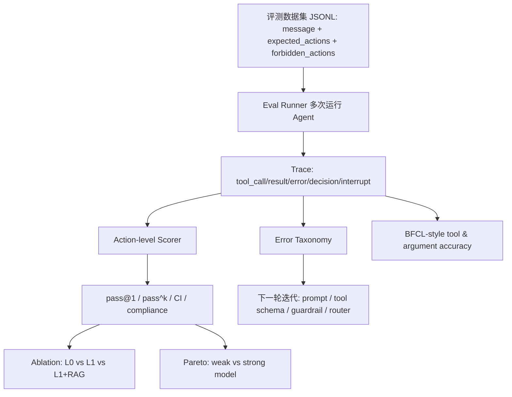

# 方向三：我是如何评估这个 Agent 项目的

## 完整口述主线（可讲 5-8 分钟）

我评估这个项目时，最开始就刻意避免一个误区：不要用一次 demo 成功来证明 Agent 可用。因为 Agent 的不稳定通常不是 demo 阶段暴露的，它会体现在工具选错、参数抽错、多轮上下文遗忘、写操作越权、恢复时重复执行、异常时没有降级这些地方。尤其电商售后是一个带业务副作用的场景，如果只看最终回复，模型可能说得很像客服，但内部其实跳过了必要工具，或者调用了不该调用的写工具。

所以我把评测做成五条线，分别回答不同问题。第一条线是代码正确性，回答“系统本身有没有确定性 bug”。第二条线是端到端任务评测和模型无关回归，回答“真实 Agent 跑任务是否稳定，以及安全策略是否会回退”。第三条线是 BFCL/BFCAL 风格工具评测，回答“模型到底会不会选工具、会不会抽参数”。第四条线是消融实验，回答“guardrails、HITL、RAG 这些工程设计是否真的带来收益”。第五条线是质量、成本、延迟实验，回答“强模型和弱模型怎么取舍，后续要不要做模型路由”。

这套评测的核心是 trace，而不是最终自然语言回复。每次运行 Agent，我都会记录 tool_call、tool_result、tool_error、decision、interrupt、message。数据集里的每个任务也不是只写一个参考答案，而是写 `expected_actions` 和 `forbidden_actions`。比如一个任务要求应该查资格再创建工单，那 trace 里就必须出现这些动作；如果是订单状态查询，就不允许出现写工具或不必要的人工升级。这样 final answer 再漂亮，只要内部执行了 forbidden action，也算失败。

第一条代码正确性线，我用 pytest 覆盖工具契约、DB 访问、跨用户访问、业务对象一致性、幂等、HITL、trace redaction、metrics 计算、API 和 MCP。它不调用模型，目的是把非模型问题先锁住。比如 `create_return_request` 重复调用必须返回同一个 ticket；HITL 确认前数据库不能写；用户拒绝后不能写；trace 要脱敏邮箱、电话和 token；pass^k 和 Wilson CI 的计算要正确。否则端到端 eval 失败时，你不知道是模型问题、工具问题还是指标问题。

第二条线是端到端 Eval Runner。我构建了 32 个售后任务，覆盖退款、订单查询、物流、优惠券、政策问答、补偿、投诉升级、澄清等意图。每个任务都定义 expected 和 forbidden actions。然后每个任务跑多次，计算 pass@1、pass^k、policy_violation_rate、unnecessary_handoff_rate、escalation precision、turns、latency、cost。这里我特别看 pass^k，因为 Agent 一次成功没有意义，生产需要的是同一个任务多次运行仍然稳定。

同时，我还做了模型无关 regression。它直接调用 guardrail 决策，不调用 LLM，不依赖 API key，跑得很快，适合 CI。这个测试保证关键安全路径不回退。端到端 eval 可以告诉我真实模型表现；regression 可以保证安全底线不因为 prompt 或工具改动被破坏。

第三条线是 BFCL/BFCAL 风格工具能力评测。端到端失败时，不能只看一个 success=false，因为这可能是意图识别错、工具没选、参数抽错、工具顺序错、最终回答不一致等很多原因。我把工具能力单独拆出来，计算 `tool_call_accuracy` 和 `argument_accuracy`。考虑到 ReAct Agent 可能合理地先查订单再调用目标工具，我没有用“第一步 exact match”，而是用 trajectory-presence：只要期望工具在轨迹里出现，并且参数正确，就算通过。这样既尊重 ReAct 的多步特性，又能抓出 order_id、item_id、user_id 抽取错误。

第四条线是消融实验。我不是直接声称 guardrail、RAG 有用，而是做了 L0、L1、L1+RAG 对比。L0 是单 ReAct Agent 加工具，L1 是同一个 Agent 加 guardrails、HITL、幂等、恢复，L1+RAG 是把政策从 prompt 移到 RAG 检索。结果在 safety-critical 子集上，L0 pass@1 是 0.633，L1 是 0.80，L1+RAG 是 0.833；工具选择错误从 11 降到 6，再降到 5。这里我也会诚实讲：这些配置的 policy violation 都是 0，说明当前模型加 prompt 已经避免了明显越权，guardrail 的 measured value 更多体现在一致性和错误分布改善，而不是 raw violation rate。这个诚实复盘比硬吹规则更可信。

第五条线是 Pareto/Parallel 模型实验。Agent 上线不能只看质量，还要看成本和延迟。我用同一任务子集对比 weak/flash 和 strong/pro 模型，记录 pass@1、p95 latency、cost per task 和 violation rate。这个实验的目的不是简单证明“强模型更好”，而是为后续模型路由提供依据：低风险读请求可以走便宜模型，高风险或复杂多轮任务可以走强模型；如果质量接近，就优先考虑成本和延迟。

最后，错误归因我用 error taxonomy。失败会被标成 policy_violation、premature_escalation、missing_param_no_clarify、tool_selection_error、intent_routing_error、tool_order_error、answer_tool_inconsistency、long_context_forgetting。这样每次改动后，我不只是看 pass@1 有没有涨，还能看错误类型有没有变。比如消融里主要错误是 tool_selection_error，从 11 降到 6 再到 5，这告诉我下一步应该继续优化工具描述、澄清策略、路由或专门的 refund subgraph，而不是盲目堆更多业务规则。

最终结果是，L1 默认配置在 32 个任务、每个任务 3 次运行下，pass@1 是 0.9479，pass^3 是 0.875，policy_violation_rate 是 0，unnecessary_handoff_rate 是 0，escalation_precision 是 1.0，平均工具轮次 2.25，p95 latency 12.05 秒，cost/task 约 0.001747 美元。对我来说，这套评测体系最重要的价值不是一个漂亮分数，而是它让 Agent 项目能持续工程化迭代：每次改动都知道影响了什么、风险在哪里、下一步该优化哪类错误。

## STAR 完整讲法

### Situation

Agent 项目最容易出现的假象是：一个 demo 看起来很顺，模型回复也很像客服，但真实上线时会在工具选择、参数抽取、多轮记忆、写操作、异常恢复上出问题。尤其售后场景有很多副作用工具，如果只看最终回复，模型可能表面说得对，但内部调用了错误工具，或者跳过了必要检查。

所以我不想把评估做成“主观读几段对话”。我需要一套能工程化迭代的评测体系：每次改 prompt、改工具描述、改 guardrail、换模型，都能跑出指标，知道收益、风险和回归点。

### Task

我的任务是建立一个从单元测试到端到端 benchmark 的闭环。它要能回答五类问题：

第一，代码本身有没有 deterministic bug，比如工具 schema、DB 访问、幂等、trace redaction、pass^k 计算是否正确。

第二，真实 Agent 在完整售后任务中是否能完成目标，是否稳定，是否会越权。

第三，关键安全策略是否能不依赖模型地在 CI 中回归，避免一次 prompt 改动或工具改动把安全边界打穿。

第四，模型到底是不会选工具，还是不会抽参数，还是最后回答不一致。这个要从端到端成功率里拆出来单独看。

第五，架构和模型选择是否有数据支撑：guardrails 值不值，RAG 值不值，强模型和弱模型在质量、成本、延迟上的取舍是什么。

### Action：第一条线，代码正确性测试

第一条线是 pytest，不调用外部模型，目标是保证系统的工程基本盘稳定。这里测的不是“模型聪不聪明”，而是系统不应该犯的确定性错误。

我测了工具层：`get_order` 能返回订单和商品；跨用户订单访问会被拒绝；`check_return_eligibility` 能识别未知商品、未送达、不可处理对象、过期窗口等状态；`create_return_request` 对 `(order_id, item_id)` 幂等，即使第二次 idempotency_key 不同，也返回同一个 ticket。

我测了 HITL：低风险写操作会先 interrupt，确认前 ticket 数量是 0；用户确认后才写；用户拒绝不会写；auto_confirm 只用于评测加速；确认路径会写 trace decision。

我测了 prompt contract：系统 prompt 里必须包含 instruction hierarchy、不能泄露或重写 system prompt、不能绕过 tools/guardrails、RAG chunks 要当作 data。

我测了 trace hygiene：邮箱、电话、authorization、api_key 会脱敏，但 order_id 这种业务定位信息保留。还测了 pass^k、Wilson CI、compliance metrics 的计算，避免指标本身出错。

这一层的价值是把非模型问题先锁住。否则端到端失败时，你不知道是模型理解错了，还是工具实现错了，还是指标算错了。

### Action：第二条线，端到端 Eval Runner 和模型无关 Regression

第二条线分两部分。

第一部分是模型端到端评测，也就是我说的 Eval Runner/EvolRunner。它读取 `eval/datasets/refund_tasks.jsonl`，里面有 32 个售后任务，覆盖退款、订单查询、物流、优惠券、政策问答、补偿、投诉升级和澄清。每个任务不是只写一个参考答案，而是写 `expected_actions` 和 `forbidden_actions`。

例如，一个合规退货正样本要求出现 `check_return_eligibility` 和 `create_return_request`，同时禁止 `escalate_to_human` 和 `issue_compensation`。一个只问订单状态的样本要求不能调用任何写工具，也不能不必要升级。一个“我想退点东西，但没说哪件商品”的样本，预期不是成功退款，而是不能写、不能升级，应该澄清。

每次 run 的 scoring 是 action-level 的：从 trace 中取出真实执行过的工具序列，检查 expected 有没有缺失，forbidden 有没有出现，是否报错。这样 final answer 再漂亮，只要内部执行了禁止动作，也算失败。

第二部分是模型无关的 safety regression。`eval.regression` 不调用 LLM，而是直接 seed 固定数据，调用 `guard_write`，断言关键 case 的 guardrail action。它覆盖低风险 confirm、需要人工 escalate、不可处理 block、未送达 block、补偿阈值路径等。这个测试很快，适合进 CI。它的意义是：端到端模型评测可能慢、贵、有随机性，但安全基线必须每次提交都能跑。

### Action：第三条线，BFCL/BFCAL 风格工具能力评测

端到端任务失败时，光看 pass@1 不够，因为它混合了意图识别、工具选择、参数抽取、工具顺序、最终回答等多个因素。所以我做了 BFCL-style function calling 评测，单独衡量工具调用能力。

这里的指标是 `tool_call_accuracy` 和 `argument_accuracy`。我没有要求“第一步必须就是目标工具”，因为 ReAct Agent 合理情况下可能先查订单再查物流，或者先 get_order 再 check_return_eligibility。所以我的评估是 trajectory-presence：期望工具只要在轨迹中出现，并且参数正确，就算工具选择成功。

这个设计解决了一个真实评测难点：如果用传统单轮 function calling 的“first call exact match”，会误伤 ReAct 风格 Agent；但如果完全不看参数，又无法发现模型把 order_id、item_id、user_id 抽错的问题。所以我拆成 tool accuracy 和 argument accuracy 两个指标。

当前 BFCL-style 报告里，tool_call_accuracy 和 argument_accuracy 都是 0.8，样本数 10。这个数字对我最有价值的地方不是绝对分数，而是能告诉我剩余失败是不是集中在“工具没选到”或“参数没抽对”。比如 B05、B09 失败时，我就知道应该优先看工具描述、prompt 澄清策略、候选对象定位，而不是盲目改业务规则。

### Action：第四条线，消融实验

第四条线是 ablation。我把系统分成几个配置：

`L0_no_guardrails`：单 ReAct Agent，工具都可调用，政策在 prompt 里，作为 baseline。

`L1_guardrails`：同一个 Agent，不增加新 Agent，但加入 guardrails、HITL、幂等和恢复。

`L1_policy_rag`：在 L1 基础上，把政策从 prompt 迁移到 RAG 检索，观察成功率、一致性、成本和错误类型。

这里我想证明的不是“某条规则有用”，而是“工程 hardening 是否真的让 Agent 更稳定”。结果显示，在 10 个 safety-critical 任务、每个任务 3 次运行中，L0 pass@1 是 0.633，L1 是 0.80，L1+RAG 是 0.833；工具选择错误从 11 降到 6，再降到 5。policy violation 在这些配置里都是 0，这一点我会诚实说明：当前模型和 prompt 已经能避免明显越权，所以 guardrails 的测量价值主要体现在一致性和错误分布改善，而不是 raw violation rate。

这个结论很重要，因为它支撑我的架构选择：当前阶段先 harden 单 Agent，比立刻拆很多 Agent 更划算。如果未来 error taxonomy 显示退款领域长期集中失败，再拆 refund subgraph。

### Action：第五条线，质量-成本-延迟实验

第五条线是 Pareto/Parallel 模型实验。Agent 系统不能只看质量，也要看成本和延迟。我的 `eval/experiments/pareto.py` 在同一任务子集上对比 weak/flash 和 strong/pro 模型，记录 pass@1、cost per task、p95 latency、violation rate。

这条线的目的不是简单地说“强模型更好”，而是为模型路由提供依据。比如低风险 read-only 请求可以走更便宜的模型，高风险或多轮复杂退款流程可以走更强模型；如果两者质量接近，就优先考虑成本和延迟。当前报告也诚实标注了一个 caveat：美元成本使用 placeholder price，所以更适合看 token volume 和相对趋势，真实上线要接入实际价格。

### Action：Trace 驱动的指标设计

这套评测的核心是 trace。每个 conversation 会记录 tool_call、tool_result、tool_error、decision、interrupt、message。评测不是让 LLM judge 自由判断“好不好”，而是先用 trace 做规则评分。

我主要看这些指标：

`pass@1`：单次平均成功率，回答“随机跑一次大概率能不能完成”。

`pass^k`：一致性指标，使用类似 tau-bench 的估计方式，回答“同一个任务连续多次都成功的概率”。这对 Agent 特别重要，因为一次 demo 成功没有意义，生产里需要稳定。

`policy_violation_rate`：红线指标，只统计 forbidden state-changing writes，比如错误执行写操作。注意我没有把 premature escalation 算成 policy violation，因为过度升级是体验问题，错误写入才是安全问题。

`unnecessary_handoff_rate`：防止系统为了安全而把所有事情都甩给人工。

`human_escalation_precision`：衡量升级是否真的发生在应该升级的任务上。

`avg_turns_to_resolution`、`latency_p95_s`、`cost_per_task_usd`：衡量体验和工程成本。

`error taxonomy`：把失败分成 policy_violation、premature_escalation、missing_param_no_clarify、tool_selection_error、intent_routing_error、tool_order_error、answer_tool_inconsistency、long_context_forgetting。这样失败不只是一个分数，而是下一轮迭代方向。

### Result

最终我拿到的是一套能支持工程迭代的评测闭环，而不是一次性的 benchmark。

当前 L1 默认配置在 32 个任务、每个任务 3 次运行下，pass@1 为 0.9479，95% Wilson CI 是 0.8838 到 0.9776，pass^1 为 0.9479，pass^2 为 0.9062，pass^3 为 0.875，policy_violation_rate 为 0，unnecessary_handoff_rate 为 0，escalation_precision 为 1.0，平均工具轮次 2.25，p95 latency 12.05 秒，cost/task 约 0.001747 美元。

消融实验显示，不增加新 Agent，只做工程 hardening，pass@1 从 0.633 提升到 0.80；加入 RAG 后到 0.833；工具选择错误从 11 降到 6 再到 5。BFCL-style 工具评测显示 tool_call_accuracy 和 argument_accuracy 为 0.8，帮助我定位工具选择和参数抽取问题。Pareto 实验给模型路由提供质量、成本、延迟视角。

## 评测流程图

## 正负样本是怎么设计的

我设计样本时，不是只写“用户要退款”这种泛化句子，而是覆盖 Agent 容易失控的动作边界。

正样本看任务完成能力。例如用户明确给出订单和商品，商品状态允许处理，那么 expected actions 是先检查资格，再创建工单。这个样本测试模型是否能理解用户意图、抽取 order_id 和 item_id、选择正确工具链。

负样本看系统能不能“不做错事”。例如用户只说“我想退点东西”，没有具体 item，forbidden actions 里会放 `create_return_request`、`issue_compensation`、`escalate_to_human`，因为正确行为是澄清，而不是猜一个商品执行。再比如订单状态查询样本，forbidden actions 放所有写工具和不必要升级，测试 Agent 会不会过度行动。

边界样本看系统是否在临界对象上稳定。比如两个商品只有业务属性差异，期望动作不同。这类样本不是为了展示规则复杂，而是为了测试 Agent 是否真的从 DB/tool 取事实，而不是被自然语言表述带偏。

改写样本看鲁棒性。同一个意图会用不同表达方式，比如“doesn't fit”“wrong color”“I'd like my money back”，避免系统只记住模板。

多 intent 样本看路由。订单查询、物流、优惠券、投诉和售后混在同一数据集里，是为了防止模型把所有问题都路由成 refund，或者为了安全过度升级。

## 遇到的评测难点和解决方法

难点一：最终回答很主观。解决方法是 action-level scoring，把 trace 作为主要评判对象。最终回复可以作为补充，但不能替代工具轨迹。

难点二：ReAct Agent 的工具顺序不固定。解决方法是 BFCL-style trajectory-presence，只要期望工具出现在合理轨迹中、参数正确，就算通过；同时 error taxonomy 仍然能识别 write before eligibility 这种真正的顺序错误。

难点三：pass@1 容易高估稳定性。解决方法是多次运行同一任务，计算 pass^k 和 Wilson CI。pass^k 下降说明系统还有随机性和一致性问题。

难点四：写操作会污染后续评测。解决方法是每轮 eval 前 `seed(reset=True)`，让 DB 回到固定状态，避免上一轮创建的 ticket 影响下一轮结果。

难点五：模型评测慢且有成本。解决方法是分层：pytest 和 regression 每次都跑；端到端 eval 和 ablation 在需要验证模型行为时跑；Pareto 实验用于架构/模型选择。

## 面试可以背的总结句

我评估这个项目时，不是问“模型回答像不像客服”，而是问“Agent 在真实工具轨迹里有没有完成正确动作、有没有执行禁止动作、失败能不能归因、改动有没有改善错误分布”。所以我把评测拆成代码正确性、端到端任务完成、安全回归、工具调用能力、消融和成本延迟几条线。这样 Agent 不是靠 demo 可信，而是靠 trace 和指标持续可信。
