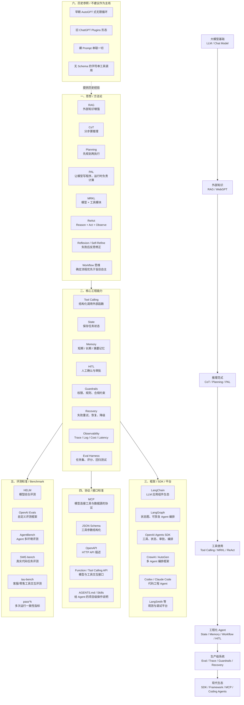

# Agent Development Map

本文件是 Agent 发展历史与知识分类的宏观地图，仅作为参考资料保存。

它不计入 RetailCare 12 阶段正式学习进度。

## 总体演进

```text
大模型基础
  -> RAG / 检索增强
  -> CoT / Planning / Program-aided Reasoning
  -> Tool Calling / Function Calling
  -> ReAct: Reason + Act 循环
  -> Workflow / Graph / State / Memory
  -> Guardrails / HITL / Recovery
  -> Harness / Eval / Observability
  -> SDK / MCP / Coding Agent / Production Agent
```

## 可视化总地图



## 分类理解

| 类别 | 解决什么问题 | 代表 |
|---|---|---|
| 思想 / 方法论 | 怎么设计 agent 的行为 | RAG、CoT、PAL、ReAct、Workflow、Reflection |
| 核心工程能力 | agent 系统必须具备什么能力 | Tool Calling、State、Memory、HITL、Guardrails、Eval、Trace |
| 框架 / SDK | 用什么工具实现这些能力 | LangGraph、LangChain、OpenAI Agents SDK、CrewAI、Codex、Claude Code |
| 协议 / 接口标准 | 模型如何连接外部世界 | MCP、JSON Schema、OpenAPI、Function Calling |
| 评测标准 | 怎么证明 agent 靠谱 | SWE-bench、tau-bench、AgentBench、pass^k、OpenAI Evals |
| 历史参照 | 了解即可，不建议主学 | 早期 AutoGPT、裸 prompt chain、旧 Plugins |

## 一句话记忆

```text
思想决定设计，工程能力决定可靠性，框架负责实现，协议负责连接，评测负责证明。
```

## 推荐搜索路线

1. `RAG tutorial for beginners`
2. `OpenAI function calling tutorial`
3. `ReAct agent explained`
4. `LangGraph tutorial state graph`
5. `LLM agent memory explained`
6. `human in the loop agents`
7. `LLM evals for agents`
8. `MCP model context protocol tutorial`
9. `Codex CLI or Claude Code agent workflow`

