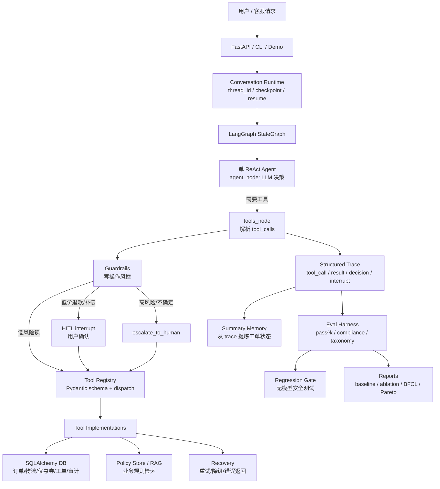

# RetailCare Actual Agent Map

本文件记录 RetailCare 项目真正用到的 Agent 架构元素。

它不是行业全景图，而是当前 repo 的实际落点。仅作为参考资料保存，
不计入 12 阶段正式学习进度。

## Visual Map



## What RetailCare Actually Uses

| 类别 | 项目里真正用到的东西 | 位置 |
|---|---|---|
| Agent 范式 | 单 Agent ReAct 循环：`agent -> tools -> agent` | `src/retailcare/graph/agent.py` |
| Workflow / Graph | LangGraph 状态图、条件路由、循环上限 | `src/retailcare/graph/agent.py` |
| State | `messages`、`user_id`、`model`、`steps`、`meta` | `src/retailcare/graph/state.py` |
| Checkpoint / Resume | SQLite checkpointer，按 `thread_id` 恢复会话 | `src/retailcare/graph/runtime.py` |
| Tool Calling | OpenAI-style tool specs + Pydantic 参数校验 | `src/retailcare/tools/registry.py` |
| Tool Contracts | 8 个工具的输入输出 schema | `src/retailcare/tools/schema.py` |
| Business Tools | 订单、物流、优惠券、退货、补偿、升级人工 | `src/retailcare/tools/impl.py` |
| Guardrails | 写操作前做规则检查：block / confirm / escalate | `src/retailcare/graph/guardrails.py` |
| HITL | 低风险写操作用 `interrupt()` 等用户确认 | `src/retailcare/graph/agent.py` |
| RAG / Policy | `search_policy` 工具与政策检索；默认主链路不总是强制启用 | `src/retailcare/policy/rag.py` |
| Memory | 从 trace 生成 ticket summary，不是复杂长期记忆 | `src/retailcare/memory/summary.py` |
| Observability | 结构化 trace：消息、工具、结果、风控、错误 | `src/retailcare/trace/logger.py` |
| Eval Harness | 任务集运行、pass^k、合规指标、错误分类 | `eval/runner.py` |
| Regression Gate | 无模型测试关键业务规则是否退化 | `eval/regression.py` |
| MCP | 把同一套工具暴露给 MCP 客户端 | `src/retailcare/mcp_server/server.py` |

## What This Project Does Not Really Use

```text
没有多 Agent 主架构
没有 CrewAI / AutoGen
没有 AutoGPT 式无限自主循环
没有 Tree of Thoughts 主流程
没有复杂长期向量记忆
没有 OpenAI Agents SDK
```

## Positioning

RetailCare 的真实定位可以概括为：

```text
单 ReAct Agent
+ LangGraph workflow/state
+ typed tool calling
+ business guardrails
+ HITL confirmation
+ checkpoint resume
+ trace observability
+ eval harness
+ MCP tool exposure
```

它不是“炫多 Agent”的项目，而是一个更工程化的可靠客服 Agent
系统 demo。最值得学习的地方，是怎么把 agent 放进业务规则、工具、
状态、评测和恢复机制里。

