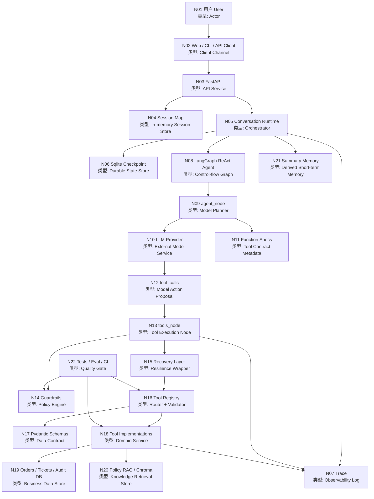
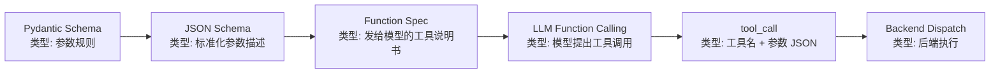
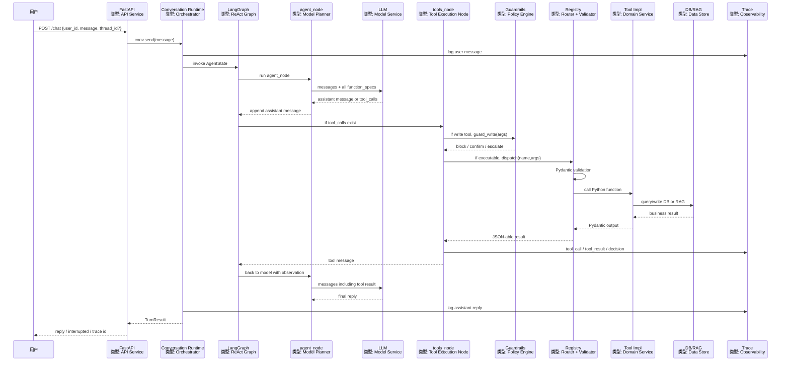

# RetailCare 全链路架构图与消息执行讲解

日期：2026-06-21

## 读图方式

每个节点都写成：

```text
节点编号. 节点名称
类型: 这个节点在系统里扮演的角色
```

重点理解一条边界：

```text
用户发起自然语言请求。
模型只负责生成 tool_call。
后端负责解析、校验、护栏判断、真正执行工具。
```

## 1. 总架构图



## 2. 节点说明表

| ID | 节点 | 类型 | 负责什么 | 主要输入 | 主要输出 | 代码位置 |
|---|---|---|---|---|---|---|
| N01 | 用户 User | Actor | 提出售后需求、确认或拒绝写操作 | 自然语言、确认决策 | 用户消息、yes/no | 外部 |
| N02 | Web / CLI / API Client | Client Channel | 把用户请求发到后端，也展示 trace 和结果 | 用户输入 | HTTP 请求 | `web/index.html`, `src/retailcare/cli.py` |
| N03 | FastAPI | API Service | 提供 `/chat`、`/confirm`、`/trace`、`/health` | JSON request | JSON response | `src/retailcare/api/app.py` |
| N04 | Session Map | In-memory Session Store | 保存当前进程内 `thread_id -> Conversation` | `thread_id`, `user_id` | Conversation 实例 | `src/retailcare/api/app.py` |
| N05 | Conversation Runtime | Orchestrator | 管理一轮/多轮对话、注入 system prompt、调用 LangGraph | message, user_id, thread_id | TurnResult | `src/retailcare/graph/runtime.py` |
| N06 | Sqlite Checkpoint | Durable State Store | 按 `thread_id` 保存 LangGraph 状态，用于 HITL 恢复 | graph state | checkpointed state | `src/retailcare/graph/runtime.py` |
| N07 | Trace | Observability Log | 记录 message、tool_call、tool_result、guardrail decision、interrupt | 运行事件 | 可复盘 JSON trace | `src/retailcare/trace/logger.py` |
| N08 | LangGraph ReAct Agent | Control-flow Graph | 组织 `agent_node -> tools_node -> agent_node` 循环 | AgentState | 新 AgentState | `src/retailcare/graph/agent.py` |
| N09 | agent_node | Model Planner | 调用 LLM，让模型判断是否需要工具 | messages + tools | assistant message 或 tool_calls | `src/retailcare/graph/agent.py` |
| N10 | LLM Provider | External Model Service | 根据 prompt 和 function specs 生成自然语言或 tool_calls | messages, tools | model response | LiteLLM / DeepSeek |
| N11 | Function Specs | Tool Contract Metadata | 告诉模型有哪些工具、用途、参数 JSON Schema | Pydantic schema + description | OpenAI-style tools list | `src/retailcare/tools/registry.py` |
| N12 | tool_calls | Model Action Proposal | 模型提出“我要调用哪个工具、参数是什么” | 模型推理结果 | tool name + JSON arguments | LLM response |
| N13 | tools_node | Tool Execution Node | 解析 tool_call，先走 guardrail，再执行工具 | tool_calls | tool messages | `src/retailcare/graph/agent.py` |
| N14 | Guardrails | Policy Engine | 对写操作做 block / confirm / escalate 判断 | tool name + args | GuardDecision | `src/retailcare/graph/guardrails.py` |
| N15 | Recovery Layer | Resilience Wrapper | 对工具 timeout/error 做 bounded retry，失败时降级并提示升级人工 | tool call | result 或 error | `src/retailcare/tools/recovery.py` |
| N16 | Tool Registry | Router + Validator | 根据工具名找到函数，用 Pydantic 校验参数并 dispatch | name + args | tool result 或 validation error | `src/retailcare/tools/registry.py` |
| N17 | Pydantic Schemas | Data Contract | 定义每个工具的输入/输出字段和类型 | Python model class | JSON Schema / validated model | `src/retailcare/tools/schema.py` |
| N18 | Tool Implementations | Domain Service | 真正查数据库、创建退款、发补偿、升级人工 | validated input | business result | `src/retailcare/tools/impl.py` |
| N19 | Orders / Tickets / Audit DB | Business Data Store | 保存订单、物流、优惠券、退款工单、补偿、审计 | SQL query / write | rows / commit | `src/retailcare/data/` |
| N20 | Policy RAG / Chroma | Knowledge Retrieval Store | 检索版本化售后政策，如 RET-003 | policy query | policy chunks | `src/retailcare/policy/` |
| N21 | Summary Memory | Derived Short-term Memory | 从 trace 里生成会话摘要，用于 UI 和复盘 | trace events | summary dict | `src/retailcare/memory/summary.py` |
| N22 | Tests / Eval / CI | Quality Gate | 防止工具、guardrail、Prompt、指标语义回归 | pytest/eval cases | pass/fail report | `tests/`, `eval/`, `Makefile` |

## 3. Schema、Function Spec、Function Calling 的位置



对应关系：

| 名词 | 谁创建 | 给谁看 | 内容 | 是否执行代码 |
|---|---|---|---|---|
| Schema | 开发者 | 后端和模型间接使用 | 参数字段、类型、必填、范围 | 不执行 |
| Function Spec | 后端生成 | 模型 | 工具名、工具描述、参数 JSON Schema | 不执行 |
| Function Calling | 模型 API 协议 | 后端接收 | 模型返回 tool_calls | 不执行 |
| Dispatch | 后端 | 后端自己 | 校验参数并调用 Python 函数 | 执行 |

例如 `create_return_request`：

```python
class CreateReturnRequestIn(BaseModel):
    user_id: str
    order_id: str
    item_id: str
    reason: str
    idempotency_key: str = Field(..., min_length=1)
```

会变成发给模型的 function spec：

```json
{
  "type": "function",
  "function": {
    "name": "create_return_request",
    "description": "WRITE: create a return/refund ticket for the current user's order...",
    "parameters": {
      "type": "object",
      "required": ["user_id", "order_id", "item_id", "reason", "idempotency_key"]
    }
  }
}
```

模型如果决定调用它，会返回 tool_call：

```json
{
  "name": "create_return_request",
  "arguments": {
    "user_id": "u1",
    "order_id": "O1001",
    "item_id": "I1",
    "reason": "wrong size",
    "idempotency_key": "return-O1001-I1"
  }
}
```

真正执行发生在后端：

```text
tools_node
-> guard_write()
-> call_with_recovery()
-> registry.dispatch()
-> Pydantic 校验
-> impl.create_return_request()
```

## 4. 全链路时序图



## 5. 代表性执行实例

### 实例 A：只读订单查询

用户请求：

```text
What is the status of my order O1001?
```

模型提出的 tool_call：

```json
{
  "name": "get_order",
  "arguments": {
    "user_id": "u1",
    "order_id": "O1001"
  }
}
```

执行链路：

| 步骤 | 谁发起 | 输入 | 做什么 | 输出 |
|---|---|---|---|---|
| 1 | 用户 | 自然语言订单查询 | 发起 `/chat` | message |
| 2 | API | `user_id=u1`, message | 找到或创建 Conversation | conv |
| 3 | Runtime | message | 注入 system prompt 和当前 user_id | AgentState |
| 4 | LLM | messages + function_specs | 判断需要查订单 | `get_order` tool_call |
| 5 | tools_node | tool_call | 解析工具名和 JSON 参数 | `name`, `args` |
| 6 | Registry | `get_order`, args | Pydantic 校验 `user_id`, `order_id` | `GetOrderIn` |
| 7 | Tool Impl | validated input | `_owned_order()` 校验订单归属 | Order row |
| 8 | DB | SQL query | 返回订单和 items | OrderView |
| 9 | LLM | tool result | 组织最终回复 | assistant reply |

无模型演示结果：

```json
{
  "err": null,
  "order_id": "O1001",
  "user_id": "u1",
  "items": ["I1", "I2"]
}
```

### 实例 B：低额退款，进入 HITL

用户请求：

```text
I want to return item I1 in order O1001, it is the wrong size.
```

模型提出的写工具 tool_call：

```json
{
  "name": "create_return_request",
  "arguments": {
    "user_id": "u1",
    "order_id": "O1001",
    "item_id": "I1",
    "reason": "wrong size",
    "idempotency_key": "demo-O1001-I1"
  }
}
```

执行链路：

| 步骤 | 谁发起 | 输入 | 做什么 | 输出 |
|---|---|---|---|---|
| 1 | 模型 | `create_return_request` tool_call | 提议创建退款工单 | tool_call |
| 2 | tools_node | tool_call | 发现是 gated write tool | 进入 guardrail |
| 3 | Guardrails | args | 检查字段、idempotency_key、退款资格 | `confirm` |
| 4 | LangGraph | `confirm` | 触发 interrupt | `interrupted=true` |
| 5 | 用户 | yes/no | 用户确认 | `yes` |
| 6 | Runtime | `Command(resume="yes")` | 按 thread_id 恢复图状态 | 恢复执行 |
| 7 | tools_node | 原 tool_call | 再次过 guardrail，确认通过后执行 | tool_call |
| 8 | Registry | args | Pydantic 校验 | `CreateReturnRequestIn` |
| 9 | Tool Impl | validated input | 写 Ticket 和 AuditLog | TicketView |
| 10 | Trace | execution events | 记录 decision/tool_call/tool_result | trace JSON |

无模型演示结果：

```text
interrupt:
Confirm create_return_request for $29.0? (yes/no)

tool_payload:
ticket_id = T02623313
refund_amount = 29.0
status = created
deduped = False
```

关键 trace：

```json
[
  {
    "kind": "decision",
    "name": "guardrail",
    "payload": {
      "tool": "create_return_request",
      "action": "confirm",
      "refund_amount": 29.0,
      "policy_versions": ["2026.06"]
    }
  },
  {
    "kind": "decision",
    "name": "user_confirmed",
    "payload": {
      "tool": "create_return_request"
    }
  },
  {
    "kind": "tool_call",
    "name": "create_return_request"
  },
  {
    "kind": "tool_result",
    "name": "create_return_request"
  }
]
```

### 实例 C：高额退款，被升级人工

用户请求：

```text
Please refund the 27-inch monitor I7 in order O1004.
```

模型可能提出：

```json
{
  "name": "create_return_request",
  "arguments": {
    "user_id": "u4",
    "order_id": "O1004",
    "item_id": "I7",
    "reason": "dont like",
    "idempotency_key": "demo-O1004-I7"
  }
}
```

但是 `I7` 金额是 201 美元，命中 RET-003：

```text
High-value refunds >= 200 USD require human review.
```

执行链路：

| 步骤 | 谁发起 | 输入 | 做什么 | 输出 |
|---|---|---|---|---|
| 1 | 模型 | `create_return_request` | 提议退款 | tool_call |
| 2 | tools_node | tool_call | 写工具，进入 guardrail | args |
| 3 | Guardrails | args | 调 `check_return_eligibility` | Eligibility |
| 4 | Tool Impl | `user_id=u4`, `order_id=O1004`, `item_id=I7` | 校验归属和金额 | `refund_amount=201` |
| 5 | Guardrails | Eligibility | 判断需要人工 | `escalate` |
| 6 | tools_node | `escalate` | 不执行写工具 | blocked payload |
| 7 | 模型 | blocked tool message | 应转而调用 `escalate_to_human` | 下一步 tool_call 或回复 |

无模型演示结果：

```json
{
  "blocked": true,
  "requires_human": true,
  "guardrail": "escalate",
  "reason": "high-value refund requires human review (RET-003): $201.0",
  "refund_amount": 201.0,
  "policy_versions": ["2026.06"]
}
```

这说明：模型可以提议高额退款，但后端不执行。

### 实例 D：跨用户访问被拒

攻击或误用输入：

```json
{
  "name": "get_order",
  "arguments": {
    "user_id": "u1",
    "order_id": "O1002"
  }
}
```

`O1002` 实际属于 `u2`。

执行链路：

| 步骤 | 谁发起 | 输入 | 做什么 | 输出 |
|---|---|---|---|---|
| 1 | 模型 | `get_order` tool_call | 试图查订单 | args |
| 2 | Registry | args | Schema 校验通过，因为字段形状合法 | `GetOrderIn` |
| 3 | Tool Impl | `user_id=u1`, `order_id=O1002` | `_owned_order()` 查归属 | ToolError |
| 4 | Recovery | ToolError | 返回错误给模型 | error |
| 5 | 模型 | error observation | 应告诉用户不可访问或需要核对订单 | reply |

无模型演示结果：

```json
{
  "result": null,
  "err": "order not found or not accessible: O1002"
}
```

这个例子说明：

```text
Schema 只能检查参数形状。
业务权限必须在工具实现里检查。
```

## 6. 四类路径对比

| 路径 | 是否调用 LLM | 是否调用工具 | 是否过 guardrail | 是否写库 | 是否 HITL |
|---|---:|---:|---:|---:|---:|
| 普通闲聊/政策问答 | 是 | 不一定 | 否 | 否 | 否 |
| 订单/物流/优惠券读取 | 是 | 是 | 否 | 否 | 否 |
| 低额退款/小额补偿 | 是 | 是 | 是，返回 confirm | 是，确认后 | 是 |
| 高额/defective/不合规 | 是 | 是 | 是，返回 escalate/block | 否 | 可能升级人工 |

## 7. 面试表达

可以这样讲：

```text
RetailCare 的架构不是用户直接问模型，而是用户请求先进入 FastAPI 和 Conversation Runtime。
Runtime 会注入 System Prompt 和 user_id，然后把消息交给 LangGraph ReAct Agent。

agent_node 调用 LLM，并一次性把所有 function_specs 发给模型。
模型如果需要外部信息，只会返回 tool_call，也就是工具名和 JSON 参数。

tools_node 收到 tool_call 后，写操作先过 guardrail。
guardrail 会重新查业务规则和订单状态，决定 block、confirm 或 escalate。
如果允许执行，Tool Registry 会用 Pydantic schema 校验参数，再 dispatch 到真正的 Python 工具函数。

工具函数负责查数据库、写退款工单、写审计日志或查 RAG。
每一步都会进入 Trace，后续可以通过 /trace 复盘。

所以模型负责决策建议，后端负责权限、校验、执行和审计。
```
