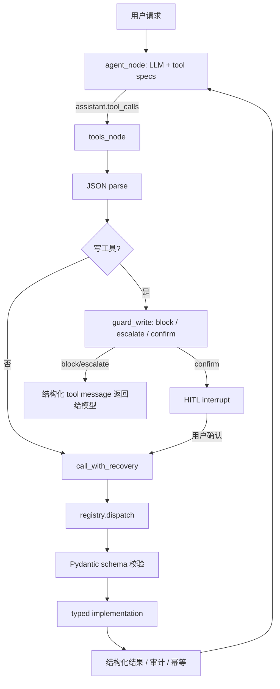

# 第 4 章：工具调用

日期：2026-06-21

## 资料页码

- 资料第 85 页：本章覆盖 Function Calling、Tool 设计、MCP、路由编排、安全和常见实现。
- 资料第 86-87 页：Function Calling 的核心是让模型输出结构化 `tool_calls`，执行权在应用层；RAG 是检索，Function Calling 是动作选择，两者经常组合。
- 资料第 88 页：工具参数需要 JSON 解析、Schema 校验、业务语义校验和高风险操作确认。
- 资料第 91 页：工具注册表需要包含名称、描述、参数规范、执行 handler，并能映射到具体 callable。
- 资料第 93 页：工具错误处理要区分可重试和不可重试错误，结合超时、熔断、降级；重试前必须考虑幂等。
- 资料第 94-97 页：MCP 把工具、资源、提示以 Server/Client/Transport 的标准协议暴露，解决跨产品复用和隔离问题。
- 资料第 103 页：模型没有天然用户身份，工具执行前必须在服务端绑定当前用户、角色、租户和权限，不能把服务密钥交给模型。
- 资料第 107-109 页：Function Calling 比纯 JSON 输出更适合工具动作；高风险操作要 HITL、结构化输出、最小权限、并发与部分失败处理。

## 本章目标

理解 RetailCare 的工具调用不是“让大模型调用几个 Python 函数”，而是：

```text
售后业务动作层 / Business Action Layer
```

模型负责提出动作意图；应用层负责解析、校验、授权、执行、审计、重试、降级和评测。这个边界是 Agent 能从聊天机器人变成可靠业务系统的关键。

## RetailCare 的 8 个工具矩阵

| 工具 | 类型 | 主要输入 | 输出 | 风险等级 | 安全设计 |
| --- | --- | --- | --- | --- | --- |
| `get_order` | 读 / Read | `order_id` | 订单和商品 | 中：用户数据 | 自动执行，未来应加 user/order ownership 校验 |
| `get_shipment` | 读 / Read | `order_id` | 物流状态 | 中：用户数据 | 自动执行，失败可降级或升级人工 |
| `search_policy` | 读 / Read | `query`, `k` | 版本化政策 chunk | 低：公共政策 | RAG 检索，返回版本和分数 |
| `get_coupon` | 读 / Read | `user_id` | 优惠券列表 | 中：用户数据 | 自动执行，未来应绑定当前会话 user_id |
| `check_return_eligibility` | 判断 / Decision | `order_id`, `item_id`, `reason` | 是否可退、金额、是否人工 | 高：影响后续退款 | 纯判断，不写库；所有退货写操作前必须调用 |
| `create_return_request` | 写 / Write | `order_id`, `item_id`, `reason`, `idempotency_key` | 退货工单 | 高：真实业务动作 | Guardrail + HITL + 幂等 + 审计 |
| `issue_compensation` | 写 / Write | `user_id`, `reason`, `amount`, `idempotency_key` | 补偿记录 | 高：发放权益 | 金额阈值 guardrail + HITL + 幂等 + 审计 |
| `escalate_to_human` | 写 / Write | `user_id`, `reason`, `transcript` | 人工交接 | 中：流程动作 | 允许升级，写审计；后续可加 handoff 幂等 |

## 调用链路



## 知识点卡片 1：Function Calling 的边界

知识点：Function Calling 不是模型执行函数，而是模型输出结构化动作请求

中英对照：函数调用 / Function Calling；工具调用 / Tool Calling；结构化动作 / Structured Action

资料依据：资料第 86-87、107 页。

资料原意：模型在合适时输出 `tool_calls` 或类似字段，参数是机器可解析的 JSON/结构化格式。真正执行代码的是应用层，这样才能做鉴权、审计、限流和错误处理。

RetailCare 例子：`agent_node` 把 `_TOOLS = openai_tools()` 传给模型；模型返回 `msg.tool_calls` 后，`tools_node` 才解析参数并调用后端工具。模型永远不直接访问数据库。

具体场景：用户问“我的 O1001 订单到了吗？”模型应该提出调用 `get_order` 或 `get_shipment`，而不是凭语言模型记忆编一个物流状态。

项目证据：

- `src/retailcare/graph/agent.py` 第 43-64 行：向 LLM 传入 tools，并把模型返回的 tool calls 转成 assistant message。
- `src/retailcare/graph/agent.py` 第 72-128 行：应用层解析 tool call、执行工具、把结果作为 tool message 返回。
- `src/retailcare/graph/prompts.py` 第 10-11 行：明确要求订单、退款金额、政策只能通过工具获得。

为什么这样设计：售后系统里订单状态、退款金额、优惠券都属于外部事实。事实来源必须是工具，而不是模型参数。模型可以选择动作，但不能拥有执行权。

替代方案：让模型直接输出自然语言答案，或者让模型输出一段“看起来像函数调用”的文本。

为什么暂时不选替代方案：自然语言和手写 JSON 更容易混入废话、字段缺失或格式错误，也很难统一校验、审计和回放。

局限与后续扩展：当前读工具的用户权限绑定还比较轻，比如 `get_order(order_id)` 没有强制校验该订单是否属于当前会话 user_id。后续应把 session user 传入工具上下文，在执行前做 ownership check。

面试表达：我把 Function Calling 理解成“模型提议动作，系统执行动作”。在 RetailCare 里，模型只产生 tool call；真正的数据库读写、规则校验、幂等和审计都在应用层完成。

## 知识点卡片 2：工具注册表与 Schema

知识点：工具注册表把工具能力描述成统一契约

中英对照：工具注册表 / Tool Registry；JSON Schema；Pydantic Contract；Handler

资料依据：资料第 87-88、91 页。

资料原意：每个工具都需要名称、描述、参数 JSON Schema 和执行 handler。注册表负责把模型侧的工具名映射到真实函数，并对参数做校验。

RetailCare 例子：`ToolDef` 同时保存 `name`、`description`、`input_model`、`fn` 和 `writes`；`openai_spec()` 会把 Pydantic model 转成 OpenAI-style function spec。

具体场景：`create_return_request` 不是一个随便传 dict 的函数，它必须满足 `order_id`、`item_id`、`reason`、`idempotency_key` 这些字段约束。

项目证据：

- `src/retailcare/tools/schema.py` 第 1-8 行：声明 8 个工具的 Pydantic I/O contracts，并区分读工具和写工具。
- `src/retailcare/tools/registry.py` 第 26-44 行：定义 `ToolDef` 和 `openai_spec()`。
- `src/retailcare/tools/registry.py` 第 47-73 行：注册 8 个工具。
- `src/retailcare/tools/registry.py` 第 76-96 行：生成 OpenAI tools，并通过 `dispatch()` 校验参数和调用实现。

为什么这样设计：工具越来越多时，如果没有统一 registry，schema、描述、执行函数和风险等级会散落在各处，后续很难评测工具选择准确率。

替代方案：在 `tools_node` 里用一堆 `if name == ...` 手写分发。

为什么暂时不选替代方案：硬编码分发短期快，但不利于复用，不利于 MCP 暴露，也不利于统一统计哪些工具是写操作。

局限与后续扩展：MCP server 当前复用了同一批 typed implementation，但 MCP 暴露定义仍然在 `mcp_server/server.py` 里手写了一遍。后续可以让 MCP 层直接从 registry 自动生成，减少重复维护。

面试表达：我的工具层有一个 registry 作为单一入口。它把 Pydantic schema 转成模型可见的 tool spec，再把模型返回的 name + arguments 分发到 typed implementation。

## 知识点卡片 3：参数校验不止 JSON Schema

知识点：参数校验要分层：语法、结构、业务语义、权限

中英对照：参数提取 / Argument Extraction；Schema Validation；Semantic Validation；Authorization

资料依据：资料第 88、103 页。

资料原意：模型可能输出不完整 JSON、错误类型、越界参数或不存在资源。系统要先解析 JSON，再用 Schema 校验结构，最后做业务层和权限层校验。

RetailCare 例子：`tools_node` 先 `json.loads`；`registry.dispatch` 再用 Pydantic input model；`check_return_eligibility` 会检查订单是否存在、商品是否存在、是否已送达、是否不可退、是否超期、是否高价值或损坏件。

具体场景：用户想退 O1001 的 I2 礼品卡。即使模型生成了格式正确的 `create_return_request`，业务层也会通过 RET-002 判断 gift card 不可退并阻断。

项目证据：

- `src/retailcare/graph/agent.py` 第 82-85 行：解析 tool call arguments。
- `src/retailcare/tools/registry.py` 第 89-92 行：Pydantic 解析失败会返回参数错误。
- `src/retailcare/tools/impl.py` 第 91-126 行：`check_return_eligibility` 做业务语义校验。
- `tests/test_tools.py` 第 59-66、97-104 行：验证不可退、超期、缺少幂等键等情况。

为什么这样设计：模型的“看起来合理”不等于业务上可执行。售后系统必须把最终判断放在代码和政策层，而不是 prompt 层。

替代方案：只在 prompt 里告诉模型“不要退礼品卡”“写操作要带 idempotency_key”。

为什么暂时不选替代方案：Prompt 约束可以降低错误，但不能保证。高风险动作必须有后端强制校验。

局限与后续扩展：当前权限校验主要体现在规则和工具边界，还没有完整的 tenant/role 权限模型。资料第 103 页强调服务端要绑定用户身份和租户，这会是 RetailCare 后续工程化的重要补点。

面试表达：我不会把工具参数校验只理解成 JSON Schema。RetailCare 里至少有四层：JSON 解析、Pydantic 结构校验、售后政策语义校验、以及未来要加强的用户权限校验。

## 知识点卡片 4：读工具和写工具的风险边界

知识点：读操作可以自动执行，写操作必须被 guardrail 和 HITL 约束

中英对照：读工具 / Read Tool；写工具 / Write Tool；人在回路 / Human-in-the-loop, HITL；护栏 / Guardrail

资料依据：资料第 88、103、109 页。

资料原意：高风险操作不能假设模型 100% 正确，应执行前做规则校验、二次确认或人工审批。工具权限要最小化，写操作要格外谨慎。

RetailCare 例子：`get_order`、`get_shipment`、`search_policy` 等读工具自动执行；`create_return_request` 和 `issue_compensation` 属于 gated write tools，会先走 `guard_write()`。低价值合规则要求用户确认，高价值或损坏件升级人工，明显不合规则 block。

具体场景：O1001-I1 是低价值普通退货，guardrail 返回 `confirm`，LangGraph `interrupt()` 暂停等待用户确认；O1002-I4 是高价值/损坏件，guardrail 返回 `escalate`，不允许自动创建退款。

项目证据：

- `src/retailcare/tools/schema.py` 第 3-8 行：读工具低风险自动执行，写工具需要 validation、policy、confirm/escalate、idempotency、audit。
- `src/retailcare/graph/guardrails.py` 第 1-8 行：明确 `allow / confirm / escalate / block` 四种决策。
- `src/retailcare/graph/agent.py` 第 87-115 行：写工具执行前走 guardrail，并可触发 HITL interrupt。
- `tests/test_hitl.py` 覆盖 guardrail routing、确认、拒绝、resume。

为什么这样设计：售后场景最危险的是“模型误操作”，比如给不可退商品退款、重复创建工单、自动批准高价值退款。把写工具收口到 guardrail + HITL，可以把模型错误控制在执行前。

替代方案：所有工具都自动执行，或者所有写操作都转人工。

为什么暂时不选替代方案：全部自动执行风险太高；全部转人工又会牺牲自动化价值。RetailCare 的折中是：低价值合规则自动化但要用户确认，高价值/损坏/不确定则人工。

局限与后续扩展：`escalate_to_human` 目前是可直接执行的流程写操作，没有 idempotency_key。它不是财务动作，风险较低，但真实生产里也应该做 handoff 去重，避免重复创建人工工单。

面试表达：我按风险把工具分层。读工具可以自动跑，财务或状态变更类写工具必须经过后端 guardrail 和 HITL。这样既保留自动化效率，又不会把执行权完全交给模型。

## 知识点卡片 5：幂等与审计

知识点：写工具必须支持幂等、去重和审计

中英对照：幂等 / Idempotency；去重键 / Deduplication Key；审计日志 / Audit Log；Exactly-once Semantics

资料依据：资料第 93、109 页。

资料原意：工具失败后常常需要重试，但重试前必须确认接口幂等，或者使用去重键，避免重复扣款、重复退款、重复写库。高风险工具也要能追踪执行记录。

RetailCare 例子：`create_return_request` 的输入必须有 `idempotency_key`，但业务去重按 `(order_id, item_id)`，所以同一商品不会因为不同 key 重复创建退货工单；`issue_compensation` 按 `idempotency_key` 去重。数据库层也对 ticket 和 compensation 的 idempotency_key 设置了唯一约束。

具体场景：HITL 暂停后恢复、工具节点重跑、网络抖动导致重试，都不应该重复创建退货或补偿。

项目证据：

- `src/retailcare/tools/schema.py` 第 106-138 行：写工具 schema 包含 `idempotency_key` 和 `deduped` 字段。
- `src/retailcare/tools/impl.py` 第 136-158 行：退货按 `(order_id, item_id)` 业务去重，并写 audit。
- `src/retailcare/tools/impl.py` 第 161-175 行：补偿按 `idempotency_key` 去重，并写 audit。
- `src/retailcare/data/models.py` 第 72-87 行：Ticket 和 Compensation 表有唯一幂等约束。
- `tests/test_tools.py` 第 76-80、107-110 行：验证退货和补偿的幂等行为。

为什么这样设计：LangGraph 的 HITL resume、工具重试、用户重复提交都可能造成同一个动作被再次触发。幂等让“重跑”变得安全。

替代方案：每次请求都生成新工单，或者只靠前端禁用按钮防重复。

为什么暂时不选替代方案：前端禁用按钮挡不住后端重试、断线恢复、并发请求和多端提交。幂等必须在后端和存储层保证。

局限与后续扩展：退货工单的业务去重按 `(order_id, item_id)` 很合理，但如果未来支持同一商品多阶段售后，如换货后再次退款，需要引入更细的售后生命周期状态。

面试表达：我把幂等作为写工具的基础能力，而不是附加优化。尤其是 Agent 会重试、会恢复、会多轮执行，如果没有幂等，可靠性机制反而可能放大错误。

## 知识点卡片 6：错误处理、重试和降级

知识点：工具调用失败要有可控恢复路径

中英对照：重试 / Retry；超时 / Timeout；熔断 / Circuit Breaker；降级 / Graceful Degradation；故障注入 / Fault Injection

资料依据：资料第 93 页。

资料原意：网络和下游工具可能失败。可重试错误如 429/5xx 可以指数退避；不可重试错误如参数错误要返回给模型；工具内部要有超时和熔断，防止拖垮系统。

RetailCare 例子：`call_with_recovery()` 包住工具 dispatch。瞬时 `timeout/error` 会重试；超过次数后返回错误，明确要求 degrade gracefully and `escalate_to_human`。`stale` 数据会在结果里标记 `_stale`。

具体场景：订单查询工具连续超时两次后恢复，系统继续处理；如果工具持续失败，Agent 不应该猜订单状态，而应该升级人工或告知无法确认。

项目证据：

- `src/retailcare/tools/recovery.py` 第 1-5 行：说明 bounded retry + graceful degradation。
- `src/retailcare/tools/recovery.py` 第 12-31 行：瞬时错误重试，失败后返回升级提示。
- `src/retailcare/tools/faults.py` 第 1-6 行：用于证明 retry -> fallback -> escalate 路径。
- `tests/test_faults.py` 第 17-34 行：覆盖瞬时恢复、永久失败升级、stale 标记。

为什么这样设计：售后 Agent 面对工具失败时，最差行为不是“失败”，而是“失败后编造”。恢复层把失败转成结构化错误，让 Agent 走安全路径。

替代方案：直接调用 `dispatch()`，失败就抛异常。

为什么暂时不选替代方案：异常如果没有被转成模型可理解的 observation，会中断对话；如果被模型忽略，又可能导致幻觉回答。

局限与后续扩展：当前实现是简单 bounded retry，没有真正的指数退避、下游超时配置、熔断状态机或按工具分类的 retry policy。第 8 章工程化实践时可以继续扩展。

面试表达：我的工具层不是只追求“能调通”，而是设计了失败路径。工具失败时系统会重试、记录、降级，并把不确定状态导向人工，而不是让模型硬猜。

## 知识点卡片 7：MCP 不是 Function Calling 的替代品

知识点：MCP 是工具暴露和复用协议，Function Calling 是模型选择动作的接口

中英对照：模型上下文协议 / Model Context Protocol, MCP；MCP Server；MCP Client；Transport

资料依据：资料第 94-97、108 页。

资料原意：MCP Server 暴露工具、资源、提示；MCP Client 运行在 Host 中并与 Server 建立会话；Transport 可以是 stdio 或 HTTP/SSE。MCP 解决的是工具集成碎片化和跨产品复用问题，不是简单替代 Function Calling。

RetailCare 例子：项目同时有 in-process Function Calling 工具层和 MCP server。Agent 运行时使用 registry/openai-style tools；MCP server 把同一批售后工具暴露给任何 MCP-capable client/IDE。

具体场景：本项目内部 Agent 可以直接调用 `get_order`；未来一个 IDE、客服工作台或外部 Agent Host 也可以通过 MCP list/call 这 8 个工具。

项目证据：

- `src/retailcare/mcp_server/server.py` 第 1-5 行：说明 MCP server 暴露售后工具层，并复用 typed implementations。
- `src/retailcare/mcp_server/server.py` 第 26-81 行：用 `@mcp.tool()` 暴露 8 个工具。
- `tests/test_mcp.py` 第 18-25 行：独立客户端能 list 出 8 个工具。
- `tests/test_mcp.py` 第 28-33 行：MCP call `get_order` 能返回真实订单数据。

为什么这样设计：Function Calling 适合当前 Agent runtime；MCP 适合跨工具宿主复用。两者结合后，工具既能服务模型循环，也能作为标准能力对外开放。

替代方案：只做项目内部 Python 函数，不暴露 MCP。

为什么暂时不选替代方案：只做内部函数会让工具能力被绑定在当前 Agent 里，后续接 IDE、桌面端、客服工作台或其他 Agent 时要重复建设。

局限与后续扩展：MCP server 目前是 stdio 风格的本地工具暴露，还没有资源、提示、租户隔离、认证、限流、远程 HTTP transport 和统一 trace 映射。这些适合放到工程化阶段。

面试表达：我不会说 MCP 替代 Function Calling。Function Calling 是模型怎么提出工具动作，MCP 是工具怎么被标准化暴露和复用。RetailCare 两层都做了：内部 Agent 用 function specs，外部集成用 MCP server。

## 知识点卡片 8：工具调用必须可观测、可评测

知识点：工具调用链路需要 trace、指标和回放

中英对照：可观测性 / Observability；轨迹 / Trace；工具选择准确率 / Tool Selection Accuracy；动作级合规 / Action-level Compliance

资料依据：资料第 21、93、109 页；第 273 页也提到工具日志、请求回放、超时、幂等和降级可写入简历。

资料原意：企业 Agent 要提供轨迹、引用、决策日志和可回放能力。工具输出应结构化，便于监控、调试和评测。

RetailCare 例子：每次工具调用、工具结果、工具错误和 guardrail 决策都会写入 trace。README 里也把 tool-selection errors、policy-violation-rate、human_escalation_precision 等作为项目结果。

具体场景：如果 eval 失败，不只看最后回答错了，还能追踪是模型选错工具、参数错、政策检索错、guardrail 错，还是工具执行失败。

项目证据：

- `src/retailcare/trace/logger.py` 第 1-57 行：记录 `tool_call`、`tool_result`、`tool_error`、`decision` 等事件。
- `src/retailcare/graph/agent.py` 第 89-125 行：guardrail 决策、工具调用、错误和结果都写 trace。
- `README.md` 第 23-25 行：项目用 pass^k、policy violation、escalation precision、tool-selection errors 等指标证明工具链路可靠性。
- `tests/test_faults.py` 和 `tests/test_hitl.py` 提供无模型、可重复的回归验证。

为什么这样设计：Agent 系统的问题经常不是单点 bug，而是“模型选择 + 参数 + 工具 + 规则 + 恢复”链路问题。没有 trace 就无法定位。

替代方案：只看最终用户回复是否满意。

为什么暂时不选替代方案：最终回复太晚、太粗，无法区分模型错、工具错还是业务规则错。售后高风险场景必须做到动作级可解释。

局限与后续扩展：当前 trace 已经能支撑本地评测，但真实生产还需要脱敏、采样、trace id 跨服务传递、告警和 dashboard。

面试表达：我的项目不只跑通工具调用，还把每次工具选择、参数、结果、错误和 guardrail 决策记录下来。这样才能做 action-level compliance 和 badcase 归因。

## 本章总图：RetailCare 的工具调用设计思想

```text
模型层：选择是否调用工具，输出 tool_calls
契约层：Pydantic schema + registry + OpenAI-style specs
安全层：guardrail + HITL + policy check + future auth
执行层：typed implementation + DB/RAG/business rules
可靠性层：idempotency + retry + graceful degradation + fault injection
集成层：MCP server
评测层：trace + unit tests + action-level metrics
```

这就是本章最重要的理解：工具调用不是一个 API 语法点，而是 Agent 工程里的“动作治理体系”。

## 和 RetailCare 项目架构的对应关系

- `src/retailcare/graph/agent.py`：ReAct 循环中的工具调用入口，负责把模型 tool_calls 接到工具层。
- `src/retailcare/tools/schema.py`：工具输入输出契约。
- `src/retailcare/tools/registry.py`：工具注册、OpenAI specs、dispatch。
- `src/retailcare/tools/impl.py`：真实业务实现，包含订单、物流、政策、退货、补偿、升级。
- `src/retailcare/graph/guardrails.py`：写操作执行前的政策和风险决策。
- `src/retailcare/tools/recovery.py`：工具执行的重试和降级。
- `src/retailcare/tools/faults.py`：故障注入，用来验证恢复路径。
- `src/retailcare/mcp_server/server.py`：把售后工具暴露成 MCP Server。
- `src/retailcare/trace/logger.py`：工具调用、结果、错误和决策日志。

## 本章验证

命令：

```bash
.venv/bin/python -m pytest tests/test_tools.py tests/test_mcp.py tests/test_faults.py tests/test_hitl.py -q
```

结果：

```text
28 passed
```

覆盖范围：

- 工具 schema 与业务实现。
- 读工具、写工具、退货资格判断。
- 幂等与去重。
- MCP list/call。
- 故障注入、重试、降级。
- Guardrail、HITL confirm/deny、resume。

## 面试版总结

如果面试官问“你项目里的工具调用怎么设计”，可以这样回答：

```text
我没有把工具调用当成简单的函数映射，而是做成了一个可治理的业务动作层。

第一，所有工具都有 Pydantic schema，并通过 registry 转成模型可见的 Function Calling spec。
第二，模型只负责提出 tool_calls，真正执行在应用层，所以可以做校验、审计、重试和权限控制。
第三，我把工具按风险分为读工具和写工具。读工具自动执行，退货和补偿这类写工具必须经过 guardrail 和 HITL。
第四，写工具都有幂等设计和审计日志，避免 HITL resume 或网络重试造成重复退款。
第五，我做了 recovery 和 fault injection，证明工具超时或失败时系统会重试、降级并升级人工，而不是让模型编造。
第六，我还把同一批售后能力暴露成 MCP Server，方便未来被其他 Agent Host 或客服工作台复用。

所以 RetailCare 的重点不是“能不能调工具”，而是工具调用是否安全、可恢复、可审计、可评测。
```

## 下一章预告

第 5 章会学习记忆系统 / Memory System。重点不是泛泛地说“Agent 有记忆”，而是把 RetailCare 中的：

- 当前会话 messages。
- LangGraph checkpoint。
- HITL resume 状态。
- trace 日志。
- derived summary。
- 业务数据库里的订单/工单状态。

区分清楚：哪些是短期记忆 / Short-term Memory，哪些是持久化状态 / Persistent State，哪些只是可观测轨迹 / Trace。
