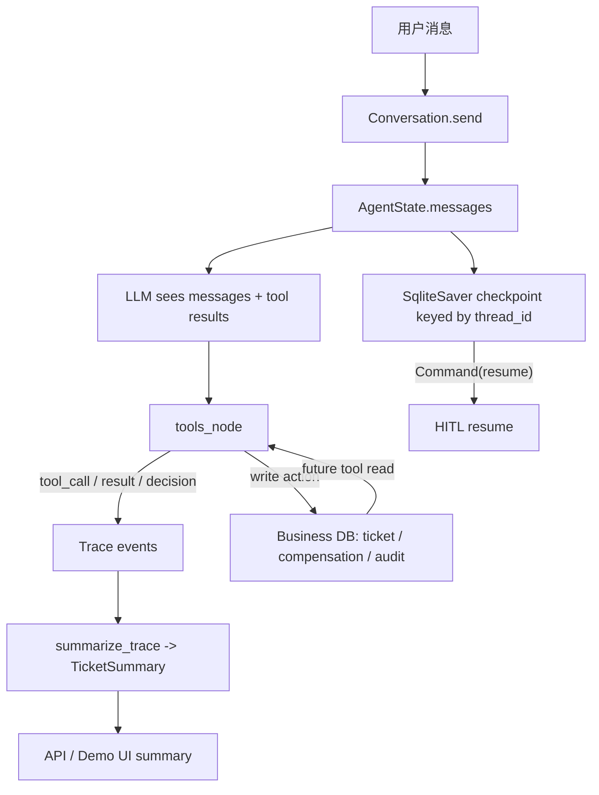

# 第 5 章：记忆系统

日期：2026-06-21

## 资料页码

- 资料第 111 页：本章主题是 Agent 记忆系统 / Memory，从为什么需要记忆到生产落地。
- 资料第 112 页：记忆可类比为感觉记忆、短期记忆、长期记忆；Agent 中对应原始输入缓存、对话上下文、向量库、用户画像、知识图谱、会话摘要归档。
- 资料第 113 页：短期记忆 / Working Memory 指当前会话或当前任务周期内模型能直接看到的信息，如 conversation buffer、滑动窗口、ReAct 轨迹。
- 资料第 116-117 页：长期记忆 / Long-term Memory 常用向量数据库 + 元数据，但订单号、账号等精确字段更适合关系库；记忆更新要有主键、版本、冲突策略和来源引用。
- 资料第 122 页：摘要记忆 / Summary Memory 可降低 token 成本，但要防止增量摘要误差累积。
- 资料第 123 页：情景记忆 / Episodic Memory 记录具体事件；语义记忆 / Semantic Memory 记录一般性知识、概念、事实和规则。
- 资料第 125-126 页：记忆检索通常混合相关性 / Relevance、近期性 / Recency、重要性 / Importance。
- 资料第 128 页：MemGPT、Mem0 等高级记忆框架强调分层、调度、记忆写入、更新、检索和冲突处理。
- 资料第 130-131 页：生产记忆系统要处理多租户、持久化、并发一致性、隐私合规、性能和恶意记忆污染。
- 资料第 132 页：记忆系统评估可看召回率、精确率、摘要一致性、冲突率、任务成功率、用户纠正次数、成本和延迟。

## 本章目标

理解 RetailCare 里的“记忆”不是单一模块，而是多个边界清楚的状态系统：

```text
工作记忆 / Working Memory
+ 可恢复状态 / Recoverable State
+ 轨迹日志 / Trace
+ 派生摘要 / Derived Summary
+ 业务事实库 / Business Source of Truth
```

RetailCare 当前不是用户画像型长期记忆系统。它更像一个售后任务型 Agent：重点是记住当前退款任务、工具轨迹、HITL 暂停点、执行结果和可审计证据。

## RetailCare 记忆边界表

| 层次 | 中英对照 | 项目位置 | 是否喂给模型 | 作用 | 风险 |
| --- | --- | --- | --- | --- | --- |
| 当前消息 | 会话上下文 / Conversation Buffer | `AgentState.messages` | 是 | 保存用户消息、assistant 消息、tool message | 越长越贵，可能注意力分散 |
| 图状态 | 工作记忆 / Working Memory | `AgentState` | 部分是 | 保存 `messages`、`user_id`、`model`、`steps`、`meta` | 不应塞复杂对象 |
| checkpoint | 可恢复状态 / Recoverable State | `SqliteSaver`, `retailcare_checkpoints.db` | 恢复后继续进入图 | 支持 HITL pause/resume、跨会话恢复 | 要按 `thread_id` 隔离 |
| trace | 轨迹 / Trace | `Trace.events`, `trace_logs/` | 默认否 | 记录 tool_call、tool_result、decision、interrupt | 需要脱敏、采样、权限 |
| summary | 摘要记忆 / Summary Memory | `TicketSummary`, `summarize_trace()` | 当前主要给 UI/评测 | 从 trace 派生工单摘要 | 摘要可能缺字段或过期 |
| 业务数据库 | 事实源 / Source of Truth | orders、tickets、compensations、audit_log | 通过工具间接进入 | 保存订单、退货、补偿和审计 | 不能和记忆混用 |
| policy RAG | 知识库 / Knowledge Memory | policy chunks + Chroma | 通过 `search_policy` 进入 | 保存售后政策规则 | 要版本化、可引用 |
| 用户画像 | 用户长期记忆 / User Long-term Memory | 当前未实现 | 否 | 未来可存偏好、历史投诉等 | 隐私、错误记忆、跨租户泄漏 |

## 记忆流转图



关键理解：

```text
checkpoint 负责“能不能接着跑”
trace 负责“发生过什么”
summary 负责“把发生过的事压成结构化摘要”
business DB 负责“真实世界状态是什么”
```

## 知识点卡片 1：短期记忆 / Working Memory

知识点：短期记忆是当前任务可见的信息，不是永久用户画像

中英对照：短期记忆 / Short-term Memory；工作记忆 / Working Memory；会话上下文 / Conversation Buffer

资料依据：资料第 112-113 页。

资料原意：短期记忆通常是当前会话或当前任务周期内模型能直接看到的信息，例如对话历史、当前 scratchpad、ReAct 轨迹、工具结果。它受 token 上限、延迟和成本约束。

RetailCare 例子：`AgentState.messages` 就是 RetailCare 的核心短期记忆。它保存 OpenAI-format chat messages，包括 system、user、assistant 和 tool messages。`steps` 是工具循环轮次，用来防止无限循环。

具体场景：用户说“我要退 O1001 订单里的 I1，尺码不合适”，之后工具返回 eligibility、ticket_id，这些都会作为 messages 和 tool messages 进入当前图状态，模型后续回答才能引用真实结果。

项目证据：

- `src/retailcare/graph/state.py` 第 8-13 行：`AgentState` 包含 `messages`、`user_id`、`model`、`steps`、`meta`。
- `src/retailcare/graph/runtime.py` 第 64-74 行：`send()` 首轮注入 system + user message，后续轮次追加 user message。
- `src/retailcare/graph/agent.py` 第 67-69 行：工具结果以 tool message 写回 messages。

为什么这样设计：售后任务通常不需要记住用户一辈子的偏好，但必须记住本轮任务中的订单号、商品号、原因、工具返回值和确认状态。

替代方案：每轮只发当前用户消息，不保留历史。

为什么暂时不选替代方案：多轮售后任务会丢失上下文。用户第二轮说“那就帮我退吧”，如果没有短期记忆，系统不知道“那”指的是哪个订单和商品。

局限与后续扩展：当前没有滑动窗口或自动摘要注入机制。如果对话很长，messages 会变贵、变慢，也可能让模型注意力分散。后续可以把早期历史压缩成结构化 ticket summary。

面试表达：RetailCare 的短期记忆主要是 LangGraph state 里的 messages。它服务当前退款任务，而不是做用户画像。这个选择符合售后场景：准确完成当前工单比泛化个性化更重要。

## 知识点卡片 2：Checkpoint 不是长期记忆，而是可恢复状态

知识点：Checkpoint 保存执行状态，用于暂停、恢复、跨会话接续

中英对照：检查点 / Checkpoint；可恢复状态 / Recoverable State；线程 ID / Thread ID；断点续跑 / Resume

资料依据：资料第 113 页关于当前任务周期记忆；资料第 128 页关于复杂 Agent 需要分层和调度。第 149 页也提到 LangGraph 强调显式图状态机与检查点/分支。

资料原意：复杂 Agent 不只需要对话上下文，还需要把执行中的状态持久化，否则中断后无法可靠恢复。

RetailCare 例子：`Conversation` 使用 LangGraph `SqliteSaver`，并用 `thread_id` 作为持久化 ticket 的标识。HITL 暂停后，用户第二天回来，只要带同一个 `thread_id`，就能 `resume_existing()` 并继续确认。

具体场景：Scenario B 中用户第 1 天触发低价值退货确认后离开，第 2 天新建一个 `Conversation` 对象，通过同一 `thread_id` 恢复，然后 `confirm("yes")` 创建退货工单。

项目证据：

- `src/retailcare/graph/runtime.py` 第 1-6 行：说明 persistent SqliteSaver 以 `thread_id` 为 key，支持第二天恢复。
- `src/retailcare/graph/runtime.py` 第 22-30 行：创建 `retailcare_checkpoints.db` 和 `_AGENT = build_agent(checkpointer=_saver)`。
- `src/retailcare/graph/runtime.py` 第 55-58 行：`_config` 把 `thread_id` 传给 LangGraph。
- `src/retailcare/graph/runtime.py` 第 76-78 行：`confirm()` 用 `Command(resume=decision)` 恢复。
- `src/retailcare/graph/runtime.py` 第 92-96 行：`resume_existing()` 重新挂到同一个 persisted ticket。
- 本地 checkpoint 数据库有 `checkpoints` 和 `writes` 两张表，当前记录数分别为 21 和 55。

为什么这样设计：HITL 天然会中断执行。如果暂停点只存在内存里，用户刷新页面、服务重启、第二天回来都会丢状态。checkpoint 把“执行到哪一步”持久化下来。

替代方案：把暂停状态写进自定义 Redis/SQL 表，自己实现状态恢复。

为什么暂时不选替代方案：LangGraph checkpoint 已经和图执行、interrupt/resume 对齐，自己实现更容易漏掉节点状态、writes 或分支信息。

局限与后续扩展：当前 checkpoint 是 SQLite，适合开发和 demo。生产环境应换成更可靠的持久化后端，并加入过期清理、租户隔离、加密和备份策略。

面试表达：我不会把 checkpoint 叫成长期记忆。它不是为了“记住用户偏好”，而是为了让任务可恢复。RetailCare 用 `thread_id + SqliteSaver` 保存图执行状态，保证 HITL 暂停后能继续执行。

## 知识点卡片 3：Trace 是可观测轨迹，不是模型工作记忆

知识点：Trace 记录发生过什么，但默认不进入模型上下文

中英对照：轨迹 / Trace；可观测性 / Observability；事件日志 / Event Log；回放 / Replay

资料依据：资料第 112 页强调记忆要按模块职责划分；资料第 132 页强调记忆评估要结合 bad case 归因。

资料原意：Agent 需要保存有用信息，但不同信息应该进入不同存储层。不是所有历史都应该直接塞回 prompt。

RetailCare 例子：`Trace` 用 contextvar 传递给当前图运行，记录 message、tool_call、tool_result、tool_error、interrupt、decision。`runtime.py` 明确说明 live Trace never stored in checkpointed state。

具体场景：当低价值退款触发 HITL，trace 会记录 `interrupt(confirm_write)`；用户确认后，trace 记录 `decision(user_confirmed)`、`tool_call(create_return_request)`、`tool_result(create_return_request)`。

项目证据：

- `src/retailcare/graph/runtime.py` 第 3-5 行：live Trace 通过 contextvar 传递，不存进 checkpoint state。
- `src/retailcare/trace/logger.py` 第 18-22 行：当前 trace 用 contextvar 保存，避免 checkpointer 序列化复杂对象。
- `src/retailcare/trace/logger.py` 第 33-63 行：定义 TraceEvent 和 tool/decision/interrupt helpers。
- `src/retailcare/graph/agent.py` 第 89-125 行：guardrail 决策、工具调用、错误和结果写入 trace。
- `tests/test_hitl.py` 第 99-116 行：验证确认路径会写 `user_confirmed`，并能从 trace 总结出 `ticket_created`。

为什么这样设计：trace 是调试、审计和评测资料，不应该默认污染模型上下文。把 trace 和 checkpoint 分开，也避免 LangGraph 序列化不可 JSON 化对象。

替代方案：把全部 trace events 都追加到 messages 里，让模型每轮都看到完整轨迹。

为什么暂时不选替代方案：全量 trace 会快速变长，增加成本和噪声，也可能把内部错误、审计字段、敏感信息暴露给模型。

局限与后续扩展：当前 trace 保存和读取还比较轻量，生产环境需要脱敏、采样、trace_id 跨服务传递、检索和 dashboard。

面试表达：我把 trace 定位为观测和复盘层，而不是模型记忆层。它记录所有工具和决策，支撑评测与 badcase 归因，但不会无脑塞回上下文。

## 知识点卡片 4：摘要记忆 / Summary Memory

知识点：摘要把长轨迹压缩成任务状态，但要防止误差和过期

中英对照：摘要记忆 / Summary Memory；结构化摘要 / Structured Summary；增量摘要误差 / Summary Drift

资料依据：资料第 122 页。

资料原意：摘要记忆能控制 token 成本，但增量摘要可能积累误差。缓解方式包括定期全量重摘要、保留关键事实清单、一致性检查、用户可编辑长期事实。

RetailCare 例子：RetailCare 的 `TicketSummary` 不是让 LLM 自由总结，而是从 trace 里确定性提取 `order_id`、`item_id`、`reason`、`eligibility`、`refund_amount`、`outcome`、`ticket_id`、`policy_versions`。

具体场景：创建退货工单后，demo 输出：

```text
Ticket summary: order=O1001, item=I1, reason=wrong size,
eligibility=ok, refund=$29.0, outcome=ticket_created, ticket=T27c8453a
```

项目证据：

- `src/retailcare/memory/summary.py` 第 1-8 行：说明 summary 是从 trace 派生的 deterministic ticket summary，用于控制长上下文成本和 UI 展示。
- `src/retailcare/memory/summary.py` 第 16-48 行：定义 `TicketSummary` 字段和 `render()`。
- `src/retailcare/memory/summary.py` 第 51-78 行：从 trace events 派生摘要。
- `src/retailcare/api/app.py` 第 43-52 行：API 返回 `summary`。
- `reports/demo_transcript.md` 第 21、40 行：demo 展示 ticket summary。
- `tests/test_memory.py` 第 6-32 行：验证 ticket_created、escalated、empty summary。

为什么这样设计：售后摘要需要精确字段，不适合完全交给模型自由生成。确定性摘要更稳定，也更容易测试。

替代方案：每轮让 LLM 总结整个对话，然后把摘要作为长期记忆。

为什么暂时不选替代方案：LLM 摘要可能漏掉订单号、金额、政策版本或把原因改写错。RetailCare 的关键字段都来自工具和 trace，确定性提取更安全。

局限与后续扩展：当前 summary 主要用于 UI/评测，还没有被自动注入模型上下文。未来可以在长对话时把 `TicketSummary.render()` 作为压缩上下文注入，但要保证和业务数据库一致。

面试表达：我的摘要记忆不是“模型凭感觉总结”，而是从 trace 里结构化派生。售后场景关心订单号、商品号、金额、ticket_id，这些字段必须可测试、可追溯。

## 知识点卡片 5：长期记忆与为什么 RetailCare 暂时不做用户画像

知识点：长期记忆适合跨会话偏好和历史，但高风险售后要谨慎写入

中英对照：长期记忆 / Long-term Memory；用户画像 / User Profile；向量记忆 / Vector Memory；元数据 / Metadata

资料依据：资料第 116-117、130-131 页。

资料原意：长期记忆常用向量数据库 + metadata；但账号、订单号等精确匹配更适合关系库。生产中还要处理多租户隔离、隐私合规、脏数据、更新冲突和删除权。

RetailCare 例子：当前 RetailCare 没有把“用户喜欢什么”“用户过去抱怨过什么”写入长期向量记忆。它把订单、优惠券、工单、补偿放在业务数据库里；把政策放在 policy RAG；把当前任务状态放在 checkpoint。

具体场景：用户问 O1001 订单，系统通过 `get_order` 查业务数据库，而不是从“长期记忆”里语义召回 O1001。订单号属于精确 ID，向量相似度不是正确工具。

项目证据：

- `src/retailcare/data/models.py` 定义订单、商品、物流、优惠券、ticket、compensation、audit_log。
- `src/retailcare/tools/impl.py` 的 `get_order`、`get_shipment`、`get_coupon` 直接查业务数据。
- `src/retailcare/policy/rag.py` 只做公共政策 RAG，不存用户私有记忆。
- 项目没有 `user_profile`、`memory_vector_store` 或跨会话用户偏好写入模块。

为什么这样设计：售后业务的真实状态应该来自业务系统，而不是模型长期记忆。尤其订单号、退款金额、工单状态都要求精确、可审计、可更新。

替代方案：给每个用户建向量记忆库，自动保存历史对话和偏好。

为什么暂时不选替代方案：当前项目目标是可靠完成高风险售后任务，不是个性化推荐助手。自动写长期用户记忆会引入 PII、误记、跨用户泄漏和删除合规问题。

局限与后续扩展：如果未来扩展到 VIP 客服、投诉历史、用户偏好，可以增加用户级长期记忆，但必须有 `user_id/tenant_id` namespace、显式写入策略、敏感字段脱敏、可删除和冲突处理。

面试表达：RetailCare 不是没有长期状态，而是没有贸然做用户画像型长期记忆。订单和工单属于业务事实，放在数据库；政策属于公共知识，放在 RAG；用户偏好型长期记忆要等隐私和隔离方案成熟后再做。

## 知识点卡片 6：情景记忆、语义记忆、程序性记忆

知识点：不同内容类型要放在不同位置

中英对照：情景记忆 / Episodic Memory；语义记忆 / Semantic Memory；程序性记忆 / Procedural Memory

资料依据：资料第 113、123 页。

资料原意：情景记忆记录具体事件；语义记忆记录通用事实和规则；程序性记忆可以落在工具说明书、工作流模板、可执行策略或少样本示例里，不一定进向量库。

RetailCare 例子：

- 情景记忆：某次会话里用户确认了 O1001-I1 的退货，trace 和 ticket 记录这件事。
- 语义记忆：RET-003 高价值退款需要人工审核，存在 policy RAG / BUSINESS_RULES 中。
- 程序性记忆：退款流程“先 check_return_eligibility，再 create_return_request 或 escalate_to_human”，写在 prompt、guardrails 和工具编排里。

具体场景：用户说“我要退这个笔记本电脑，它是坏的。”系统不是从用户画像里找答案，而是按程序性规则先查资格，再根据语义政策 RET-004 升级人工，最后把这次事件写入 trace/summary。

项目证据：

- `src/retailcare/graph/prompts.py` 第 21-30 行：写明退款和补偿的操作规则。
- `src/retailcare/graph/guardrails.py` 第 42-70 行：把程序性规则落成代码决策。
- `src/retailcare/policy/store.py` 保存语义政策规则。
- `src/retailcare/trace/logger.py` 和 `src/retailcare/memory/summary.py` 保存具体事件轨迹和摘要。

为什么这样设计：把所有东西都塞进“memory vector DB”会混乱。流程规则应该可执行，业务事实应该查数据库，公共规则应该 RAG，具体事件应该 trace/summary。

替代方案：把所有历史对话、政策、流程说明都写入一个向量库。

为什么暂时不选替代方案：一个向量库承载所有记忆会导致检索污染：流程规则、用户事件和业务事实互相干扰，权限和更新策略也不同。

局限与后续扩展：后续可以把情景记忆做成可检索的投诉/工单历史，但要和用户权限、数据保留周期绑定。

面试表达：我会按内容类型设计记忆。RetailCare 里，政策是语义记忆，退款流程是程序性记忆，某次退货确认是情景记忆。它们不应该混在一个存储里。

## 知识点卡片 7：记忆检索策略

知识点：长期记忆检索通常要混合相关性、近期性和重要性

中英对照：相关性 / Relevance；近期性 / Recency；重要性 / Importance；记忆检索 / Memory Retrieval

资料依据：资料第 117、125-126 页。

资料原意：记忆检索不能只看向量相似度。生产中常综合语义相关性、最近发生/访问时间、重要性评分，有时还需要用户反馈和规则加权。

RetailCare 例子：当前 RetailCare 没有用户长期记忆检索，因此也没有 relevance + recency + importance 的记忆打分。它在当前任务里直接使用 messages/checkpoint；公共政策检索则属于 RAG，不是用户记忆检索。

具体场景：如果未来用户有多次投诉历史，系统可能需要优先召回“最近一次未解决的高优先级投诉”，而不是语义上最像的一条旧聊天。

项目证据：

- 当前代码没有 `importance_score`、`last_accessed`、`memory_id`、`user_memory` 等长期记忆字段。
- `summarize_trace()` 是确定性遍历 trace，不做向量召回或综合打分。
- `policy/rag.py` 的相似检索服务政策知识，不服务用户画像。

为什么这样设计：项目当前任务是售后流程自动化，核心记忆需求是当前任务状态和可恢复性，不是跨会话个性化。

替代方案：引入 Mem0 或自建 vector memory，为用户历史对话做打分召回。

为什么暂时不选替代方案：没有明确业务指标证明需要长期用户记忆，先做会增加隐私和错误召回风险。

局限与后续扩展：如果后续要做“投诉升级时参考最近三次售后失败经历”，可以增加结构化 episodic memory 表，并用 `recency + importance + status` 排序，不一定一开始就用向量。

面试表达：我知道长期记忆检索常用 relevance、recency、importance 综合打分。但 RetailCare 当前没有强行实现它，因为售后任务的首要记忆需求是可恢复执行，而不是个性化召回。

## 知识点卡片 8：记忆的生产风险与评估

知识点：记忆系统要能隔离、删除、评测和归因

中英对照：多租户隔离 / Multi-tenant Isolation；隐私合规 / Privacy Compliance；记忆污染 / Memory Poisoning；摘要一致性 / Summary Consistency

资料依据：资料第 130-132 页。

资料原意：生产记忆系统最容易出事故的是租户隔离失败和敏感数据写入长期记忆。评估要看离线召回/精确率、摘要一致性、冲突率，以及在线任务成功率、用户纠正次数、成本和延迟。

RetailCare 例子：RetailCare 当前规避了很多长期记忆风险：不自动把用户对话写进向量库；trace 不默认进入模型上下文；checkpoint 以 thread_id 隔离；业务事实通过工具查询。

具体场景：如果用户在聊天里提供地址或电话，当前系统不会自动把它写入长期向量记忆。这比“什么都记住”更符合售后高风险场景。

项目证据：

- `src/retailcare/trace/logger.py` 第 18-22 行：trace 不进 checkpoint。
- `src/retailcare/graph/runtime.py` 第 55-58 行：checkpoint 按 `thread_id` 隔离。
- `tests/test_memory.py` 用确定性断言测试摘要一致性。
- `tests/test_hitl.py` 测试 pause/resume 后写操作是否正确执行或拒绝。

为什么这样设计：记忆越多，越可能带来隐私、污染、错误召回和过期状态问题。RetailCare 先把高价值的任务状态记准，再考虑个性化长期记忆。

替代方案：默认保存所有对话，后续靠检索过滤。

为什么暂时不选替代方案：默认保存一切会放大合规风险，而且“后续过滤”挡不住写入阶段已经污染长期记忆。

局限与后续扩展：如果要生产化，仍需补充 checkpoint/trace 的 TTL、脱敏、加密、租户字段、删除接口和访问审计。

面试表达：我对记忆系统的态度是最小必要记忆。RetailCare 只保存完成售后任务所需的状态和审计，不默认沉淀用户私密长期记忆。这样更容易满足合规和可解释性。

## 本章总图：RetailCare 的记忆设计思想

```text
模型需要看到的：messages + selected tool results
系统需要恢复的：LangGraph checkpoint keyed by thread_id
工程需要排查的：Trace events
UI/评测需要展示的：TicketSummary
业务需要信任的：orders / tickets / compensations / audit_log
未来可能需要的：user profile / episodic complaint memory
```

最重要的一句话：

```text
RetailCare 以短期任务记忆和可恢复状态为主，谨慎对待用户长期记忆。
```

这和项目定位一致：它不是陪伴型助手，而是高风险售后任务执行系统。

## 和 RetailCare 项目架构的对应关系

- `src/retailcare/graph/state.py`：定义模型工作记忆和图状态。
- `src/retailcare/graph/runtime.py`：创建 `Conversation`、checkpoint、thread_id、send/confirm/resume。
- `src/retailcare/graph/agent.py`：把 tool calls 和 tool results 追加到 messages，并在 HITL 时 interrupt。
- `src/retailcare/trace/logger.py`：记录工具调用、结果、错误、决策和中断。
- `src/retailcare/memory/summary.py`：从 trace 派生结构化 ticket summary。
- `src/retailcare/api/app.py`：把 summary 暴露给 Web/API。
- `src/retailcare/demo.py`：演示单会话 HITL 和跨会话 resume。
- `tests/test_memory.py`：验证摘要记忆。
- `tests/test_hitl.py`：验证 pause/resume 和 trace 决策。

## 本章验证

命令：

```bash
.venv/bin/python -m pytest tests/test_memory.py tests/test_hitl.py -q
```

结果：

```text
11 passed
```

额外检查：

```text
retailcare_checkpoints.db tables: checkpoints, writes
checkpoint count: 21
writes count: 55
```

这说明项目确实有持久化 checkpoint 记录，而不只是进程内临时状态。

## 面试版总结

如果面试官问“你项目里的记忆系统怎么设计”，可以这样回答：

```text
RetailCare 的记忆系统是分层的。

第一层是短期工作记忆，也就是 LangGraph state 里的 messages，保存当前会话、工具结果和任务上下文。
第二层是 checkpoint，用 SqliteSaver 按 thread_id 持久化图状态，支持 HITL 暂停和跨会话恢复。
第三层是 trace，记录工具调用、结果、错误、interrupt 和 guardrail decision，用于审计、评测和 badcase 归因，但默认不塞回模型上下文。
第四层是 deterministic ticket summary，从 trace 中提取订单号、商品号、退款金额、ticket_id 和 outcome，用于 UI 和未来长上下文压缩。
第五层是真实业务数据库，保存订单、工单、补偿和审计，是事实源，不把这些精确事实交给向量记忆解决。

我暂时没有做用户画像型长期记忆，因为售后高风险场景更需要精确、可恢复、可审计，而不是自动记住所有用户对话。未来如果做长期记忆，我会先设计 user_id/tenant_id 隔离、脱敏、TTL、删除权和冲突更新策略。
```

## 下一章预告

第 6 章会学习多智能体系统 / Multi-Agent System。重点问题是：

```text
RetailCare 什么时候需要多 Agent，什么时候单 Agent 更可靠?
```

我们会把资料里的 supervisor、specialist agents、handoff、blackboard、debate/critic 等概念，和 RetailCare 当前“单 ReAct + 工具层 + guardrail”的架构做对比。
