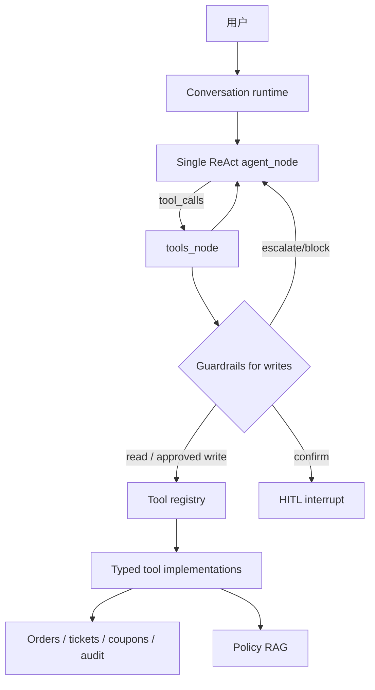
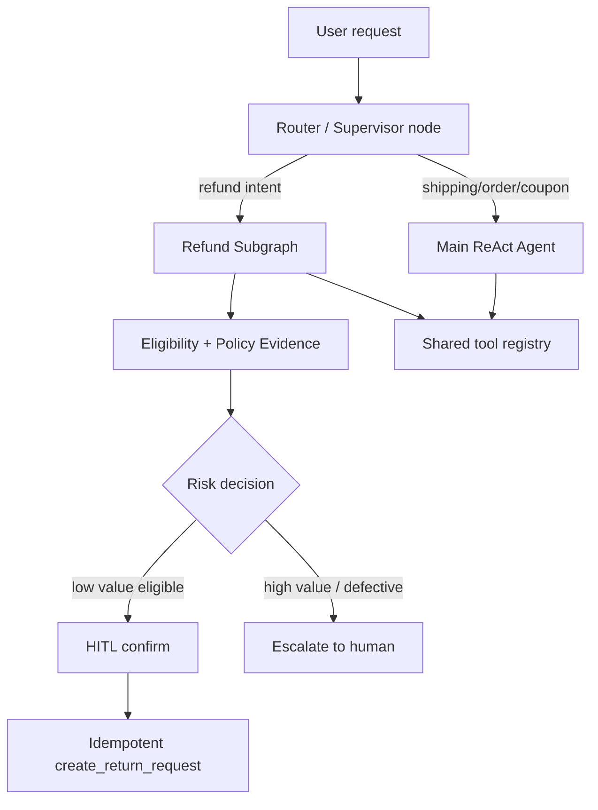

# 第 6 章：多智能体系统

日期：2026-06-21

## 资料页码

- 资料第 134 页：本章主题是多智能体系统 / Multi-Agent Systems，覆盖为什么不用一个超大 Agent、协作模式、通信、任务分配、冲突解决、状态同步和生产落地。
- 资料第 135 页：多 Agent 的主要优势是专业化分工 / Specialization、并行处理 / Parallelism、失败隔离 / Failure Isolation；单 Agent 容易遇到注意力、上下文和能力边界。
- 资料第 137-138 页：三大协作模式是 Boss-Worker、Pipeline、Joint Discussion；各自有瓶颈，例如 Boss 单点、Pipeline 错误传递、讨论空转。
- 资料第 140-141 页：Agent 通信可以用直接消息、共享黑板 / Blackboard、Pub-Sub、消息队列；黑板强调共享状态快照，队列强调可靠投递。
- 资料第 143-144 页：任务分配可以是固定 pipeline、能力匹配、负载感知、动态分配或竞拍机制。
- 资料第 145 页：多 Agent 可能产生冲突，需要投票、优先级、主席或证据优先等冲突解决机制。
- 资料第 153 页：生产多 Agent 面临 token 成本、延迟、死循环、错误传播、调试和可观测性挑战。
- 资料第 155 页：单 Agent + 多工具适合统一策略调用不同 API；多 Agent 更适合角色隔离、并行、对抗评审和组织流程。

## 本章目标

理解 RetailCare 当前为什么不是多 Agent，以及未来什么时候才值得拆：

```text
先硬化单 Agent / Harden Single Agent First
再用评测数据决定是否拆分 / Split Only If Metrics Demand It
```

RetailCare 现在是：

```text
单 ReAct Agent + typed tool layer + guardrails + HITL + RAG + eval harness
```

不是因为不知道多 Agent，而是因为当前证据显示：在 5 类售后意图里，先强化工具边界、规则护栏、RAG 和评测，比马上引入 supervisor/specialist agents 更划算。

## RetailCare 当前拓扑



它处理的不是一个“全能大脑 + 任意工具”，而是一个受约束的售后 Agent：

- 5 类意图：订单、物流、退货退款、优惠券/补偿、投诉升级。
- 8 个工具：订单、物流、政策、优惠券、退货资格、创建退货、发补偿、人工升级。
- 高风险写操作：统一经过 guardrail、HITL、幂等、审计。
- 评测：pass^k、policy violation、handoff precision、error taxonomy、cost/latency。

## 多 Agent 决策矩阵

| 方案 | 适合场景 | RetailCare 当前判断 |
| --- | --- | --- |
| 单 Agent + 多工具 / Single Agent with Tools | 任务边界清楚、工具数量可控、需要统一政策 | 当前最佳基线 |
| Refund Specialist Agent | 退款错误持续集中，普通意图和退款意图互相干扰 | 未来 L2 候选 |
| Logistics Specialist Agent | 物流任务需要复杂外部 API、异常追踪、异步通知 | 当前还不需要 |
| Coupon/Compensation Agent | 补偿策略复杂、营销规则多、权限独立 | 当前工具和 guardrail 足够 |
| Complaint/Escalation Agent | 投诉升级需要情绪识别、SLA、人工队列、法律风险 | 可作为后续增强 |
| Critic/Verifier Agent | 需要对高风险动作做第二视角审查 | 可先用规则 guardrail，必要时再加 |
| Supervisor-Worker | 意图多、工具多、子任务长、需要统一路由 | 当前会增加额外延迟和调试复杂度 |

## 知识点卡片 1：单 Agent vs 多 Agent 的根本取舍

知识点：多 Agent 不是越多越高级，而是用组织复杂度换专业化和隔离

中英对照：单智能体 / Single Agent；多智能体 / Multi-Agent；专业化分工 / Specialization；协调成本 / Coordination Cost

资料依据：资料第 135、155 页。

资料原意：多 Agent 可以让不同角色有更小的提示词、更窄的工具集、更强的专业职责，也可以并行处理和隔离失败。但如果只是统一策略调用不同 API，单 Agent + 多工具通常更简单、延迟更低。

RetailCare 例子：RetailCare 现在用一个 ReAct Agent 管 8 个工具和 5 类售后意图。它不是无约束的“大杂烩”，因为工具层、guardrail、RAG、HITL、checkpoint 和 trace 已经把风险分层了。

具体场景：用户问订单状态、物流、普通低额退货、高额退款或优惠券，都是售后闭环的一部分。当前单 Agent 能统一遵守同一套政策：事实必须查工具，写操作必须校验，危险动作升级人工。

项目证据：

- `ARCHITECTURE.md` 第 3-7 行：架构 deliberately restrained，是 single ReAct agent over typed tool layer。
- `ARCHITECTURE.md` 第 9-21 行：拓扑是实验结果，不是预设；L2 只在数据证明需要时拆 refund subgraph。
- `src/retailcare/graph/agent.py` 第 1-10 行：明确当前是 single ReAct LangGraph StateGraph。
- `README.md` 第 23-25 行：L1 单 Agent 已达到较高可靠性，并说明 hardening pays off, no new agent。

为什么这样设计：售后系统的核心风险不是“角色不够多”，而是写操作不安全、政策不一致、工具选择不稳定、失败不可恢复。RetailCare 先解决这些基础问题。

替代方案：一开始就拆成 refund agent、logistics agent、coupon agent、complaint agent，再加 supervisor。

为什么暂时不选替代方案：拆分会带来路由错误、状态同步、跨 Agent 上下文传递、成本和延迟。当前工具数量和任务长度还没有证明必须拆。

局限与后续扩展：如果未来工具数超过 15 个、prompt 明显变长、退款任务错误持续集中，单 Agent 可能会到边界。那时再拆 refund specialist 更有依据。

面试表达：我没有为了“多 Agent”而多 Agent。RetailCare 先用单 ReAct Agent 做可评测基线，再通过消融和错误分类决定是否拆分，这比凭感觉设计 supervisor 更稳。

## 知识点卡片 2：Boss-Worker / Supervisor 模式

知识点：Supervisor 负责拆解、路由和汇总，Worker 负责专业执行

中英对照：主管-工人模式 / Boss-Worker；监督者 / Supervisor；专业 Worker / Specialist Worker

资料依据：资料第 137-138 页。

资料原意：Boss-Worker 模式中，Boss/Manager 负责任务分解、分配和汇总，多个 Worker 执行子任务。优点是路径清晰、易审计；风险是 Boss 成为瓶颈，规划错误会放大全局。

RetailCare 例子：如果未来拆成多 Agent，一个自然方案是：

```text
Supervisor Agent
  -> Refund Agent
  -> Logistics Agent
  -> Coupon/Compensation Agent
  -> Complaint Escalation Agent
  -> QA/Critic Agent
```

具体场景：用户说“我的笔记本电脑坏了，物流也很慢，还要投诉”。Supervisor 先识别这是 refund + logistics + complaint 的组合任务，再分给不同 specialist，最后汇总给用户。

项目证据：

- 当前 `graph/agent.py` 只有 `agent_node` 和 `tools_node`，没有 supervisor/worker 节点。
- `RetailCare_Orchestrator_项目定义_v1.md` 第 54-70 行：v1 是单 Agent 形态，后续可把退款拆成独立子图做对比。
- `ARCHITECTURE.md` 第 16-17 行：L2 只在 L1 后仍有系统性 domain confusion 时拆 refund subgraph。

为什么这样设计：Supervisor 模式适合任务组合复杂、多个专业域独立演进、权限边界差异明显的系统。RetailCare 当前售后意图虽多，但主链路短，工具合同清楚，先不需要 supervisor。

替代方案：现在就实现 Supervisor + 4 个 Worker。

为什么暂时不选替代方案：Supervisor 自身也会犯路由错误；如果 Boss 把普通订单查询误路由给退款 Agent，复杂度反而上升。

局限与后续扩展：未来可以把 Supervisor 作为一个 LangGraph router node，而不是另起一套不可观测的自由对话多 Agent。所有路由结果都要进 trace 和 eval。

面试表达：Supervisor 模式我会用于任务拆解和权限隔离，但 RetailCare 当前没有马上上。因为现有错误主要是工具选择和缺参数澄清，先强化路由提示和 guardrail 更直接。

## 知识点卡片 3：Pipeline 模式

知识点：Pipeline 适合 SOP 固定、输入输出契约清晰的流程

中英对照：流水线模式 / Pipeline；标准作业流程 / SOP；质检环 / Quality Gate

资料依据：资料第 138、143 页。

资料原意：Pipeline 是 A -> B -> C 的串行结构，上游输出作为下游输入，适合固定文档/数据处理和稳定 SOP；风险是错误逐级传递，难以回溯。

RetailCare 例子：退款闭环天然有 Pipeline 味道：

```text
取订单/商品 -> 检索政策 -> 资格判断 -> 用户确认/人工升级 -> 幂等执行 -> 回执 -> trace
```

但 RetailCare 没把每一步都拆成独立 Agent，而是用一个 Agent + 工具/规则节点完成。

具体场景：低价值合规退货 O1001-I1：先 `check_return_eligibility`，再 `create_return_request`。这个顺序由 prompt、guardrail 和测试共同约束。

项目证据：

- `RetailCare_Orchestrator_项目定义_v1.md` 第 94-105 行：定义退款核心闭环状态机。
- `src/retailcare/graph/prompts.py` 第 21-30 行：要求退款先资格判断，再写操作或升级。
- `src/retailcare/graph/guardrails.py` 第 42-60 行：写操作前再次检查 eligibility。
- `eval/error_taxonomy.py` 第 40-45 行：如果 create_return_request 早于 check_return_eligibility，会标为 `tool_order_error`。

为什么这样设计：RetailCare 的退款流程是强规则 SOP，用代码和工具顺序约束比拆多个 LLM Agent 更稳定。

替代方案：Eligibility Agent -> Confirmation Agent -> Execution Agent -> Receipt Agent。

为什么暂时不选替代方案：这个流程短、规则强、I/O 清楚。拆多个 LLM Agent 会增加 token 成本和错误传播点。

局限与后续扩展：如果未来退款流程变成多阶段，如验货、仓库确认、支付网关、风控审核、财务对账，可以把 Pipeline 节点服务化，但不一定每个节点都要是 LLM Agent。

面试表达：退款闭环确实像 Pipeline，但我把它落成工具和 guardrail 状态机，而不是多个聊天 Agent。因为固定 SOP 更适合确定性节点。

## 知识点卡片 4：Joint Discussion / Critic Agent

知识点：讨论型或批评者 Agent 适合不确定、高风险、需要第二视角的任务

中英对照：联合讨论 / Joint Discussion；批评者 / Critic；验证者 / Verifier；对抗评审 / Adversarial Review

资料依据：资料第 137-138、145、155 页。

资料原意：多个 Agent 可以用讨论、投票、证据优先等方式解决冲突，适合开放性问题或高风险审查。但讨论容易空转，多个模型不一定真的独立。

RetailCare 例子：当前 RetailCare 没有 Critic Agent，而是用 deterministic guardrail 做高风险审查。比如高价值退款、损坏件、不可退品类，由代码和政策决定 block/escalate/confirm。

具体场景：用户要求退 $884 的 defective laptop。与其让 Refund Agent 和 Critic Agent 讨论，不如直接根据 RET-003/RET-004 触发 `escalate_to_human`。

项目证据：

- `src/retailcare/graph/guardrails.py` 第 53-60 行：不可退 block，需要人工的高风险退款 escalate，低价值合规 confirm。
- `reports/ablation_report.md` 第 21-24 行：guardrails 已经提升一致性，L2 多 Agent 仍是 future work。
- `reports/baseline_report.md` 第 4-7 行：当前 L1 单 Agent policy_violation_rate 0.0，escalation_precision 1.0。

为什么这样设计：售后政策是明确规则，不是开放式辩论。能用规则强约束的地方，不必用第二个 LLM Agent。

替代方案：所有写操作前让 Critic Agent 审查一次。

为什么暂时不选替代方案：Critic 会增加延迟和成本，而且 Critic 也可能错。当前规则 guardrail 更可测试、更可解释。

局限与后续扩展：如果未来引入图像质检、欺诈风险、复杂投诉，规则不够覆盖时，可以加 Verifier/Critic Agent，对高风险案例做二次判断。

面试表达：我把 Critic Agent 看作高风险不确定场景的补充，而不是默认配置。RetailCare 当前高风险退款有明确政策，所以先用规则 guardrail，比让两个模型互相讨论更可靠。

## 知识点卡片 5：通信机制与共享状态

知识点：多 Agent 最大的工程难点之一是状态同步和通信边界

中英对照：直接消息 / Direct Message；共享黑板 / Blackboard；发布订阅 / Pub-Sub；消息队列 / Message Queue；全局真相 / Global Truth

资料依据：资料第 140-141、155 页。

资料原意：通信机制决定 Agent 如何交换信息与引用共享事实。黑板是共享状态容器，队列是事件/任务管道。多 Agent 需要明确全局真相、状态机和事件驱动，否则容易冲突。

RetailCare 例子：当前单 Agent 避免了复杂 Agent-to-Agent 通信。共享事实来自 business DB、policy RAG、checkpoint 和 trace，而不是多个 Agent 私下互发自然语言。

具体场景：订单状态来自 `get_order`，政策来自 `search_policy`，退款结果来自 `create_return_request`，这些都是结构化工具结果。模型之间没有“我觉得订单已退款”的非结构化传话。

项目证据：

- `src/retailcare/tools/schema.py` 定义工具 I/O contract。
- `src/retailcare/trace/logger.py` 记录工具调用和决策。
- `src/retailcare/graph/runtime.py` 用 checkpoint 保存图状态。
- `src/retailcare/data/models.py` 保存 orders/tickets/compensations/audit_log。

为什么这样设计：售后系统需要确定的事实源。多个 Agent 如果靠自然语言传状态，容易出现状态漂移和责任不清。

替代方案：Agent 之间用聊天消息互相描述订单和政策状态。

为什么暂时不选替代方案：自然语言传状态不可测试，容易丢字段、改金额、漏政策版本。结构化工具和 trace 更适合业务系统。

局限与后续扩展：未来多 Agent 版本可以使用共享黑板，但黑板内容应是结构化对象，如 `case_state`、`policy_evidence`、`risk_decision`，而不是自由文本聊天。

面试表达：如果做多 Agent，我不会让它们随便聊天传业务事实，而会用结构化 blackboard 或状态机。RetailCare 当前先用单图状态和工具结果，降低同步复杂度。

## 知识点卡片 6：任务分配与路由

知识点：任务分配要基于能力、负载、风险和评测，不只是关键词路由

中英对照：任务分配 / Task Allocation；能力匹配 / Capability Matching；动态路由 / Dynamic Routing；竞拍机制 / Auction

资料依据：资料第 143-144 页。

资料原意：任务分配可以按固定 Pipeline、能力匹配、负载、动态发现子问题或竞拍报价进行。工程上常混合主干 Pipeline 和局部动态分配。

RetailCare 例子：当前 RetailCare 没有独立 router Agent。它通过单 Agent 工具选择来隐式路由，通过 error taxonomy 观察工具选择是否可靠。

具体场景：用户“我的包裹在哪”应调用 `get_shipment`；用户“我要退 I1”应调用 `check_return_eligibility`；用户“我要投诉经理”应调用 `escalate_to_human`。如果这些工具选择错误持续出现，才说明需要更显式的 router 或 specialist。

项目证据：

- `eval/datasets/refund_tasks.jsonl` 覆盖 32 个不同 intent/action 组合。
- `reports/error_taxonomy.md` 第 21-34 行：失败主要是 `tool_selection_error`，L0->L1->RAG 从 11 降到 5。
- `eval/error_taxonomy.py` 第 25-57 行：失败会被标为工具选择、顺序、缺参数、策略违规等类别。
- `reports/baseline_report.md` 第 7 行：当前剩余错误是 `tool_selection_error: 5` 和 `missing_param_no_clarify: 1`。

为什么这样设计：工具选择错误是可以先通过 prompt、tool description、guardrail、clarification policy 和 router rules 改进的，不一定马上拆多 Agent。

替代方案：为每个 intent 做一个 specialist，入口先分类再转交。

为什么暂时不选替代方案：当前意图数量有限，分类器/路由器会新增一个错误源。除非数据显示某个 intent 在单 Agent 下长期拖累指标，否则先不拆。

局限与后续扩展：如果 `tool_selection_error` 在退款任务中长期高于阈值，比如连续 eval 中 refund 相关失败占失败总数 > 50%，可以引入 refund router/subgraph。

面试表达：我会先看错误分类，而不是凭感觉拆 Agent。RetailCare 当前剩余问题主要是工具选择和缺参数澄清，所以先优化工具路由和澄清策略；如果错误集中在退款域，再拆退款 specialist。

## 知识点卡片 7：生产多 Agent 的成本与风险

知识点：多 Agent 带来 token、延迟、死循环、错误传播和可观测性成本

中英对照：Token 成本 / Token Cost；延迟 / Latency；死循环 / Dead Loop；错误传播 / Error Propagation；分布式追踪 / Distributed Trace

资料依据：资料第 153 页。

资料原意：生产多 Agent 会造成多轮讨论、重复上下文、串行调用延迟、互相等待、重复计划、错误传播和调试困难。常见手段包括摘要、引用 ID、小模型子任务、最大步数、状态去重、断路器、结构化日志和 TraceId。

RetailCare 例子：当前单 Agent 已经有 `MAX_STEPS = 8` 防止 ReAct 循环，trace 记录工具和决策，pareto 实验记录质量/成本。多 Agent 会让这些问题都放大。

具体场景：如果一个 Supervisor 把任务交给 Refund Agent，Refund Agent 又要求 Policy Agent 检索，Policy Agent 再把结果交回 Supervisor，最后 Critic 再审查，单个退款请求可能多 3-5 次模型调用。

项目证据：

- `src/retailcare/graph/agent.py` 第 27、131-135 行：`MAX_STEPS = 8` 和 `_route()` 防止无限工具循环。
- `reports/pareto_report.md` 第 5-21 行：已有质量 x 成本视角，强调 cost-aware evaluation。
- `eval/metrics.py` 第 68-85 行：计算 latency p95 和 cost/task。
- `src/retailcare/trace/logger.py` 记录结构化 trace，当前单 Agent 可观测性比较清楚。

为什么这样设计：RetailCare 是高风险售后系统，评价标准包括可靠性、合规、延迟和成本。多 Agent 如果没有明显提升 pass^k 或降低违规率，就不值得引入。

替代方案：默认所有复杂任务都走多 Agent 讨论和审查。

为什么暂时不选替代方案：默认多 Agent 会增加稳定性变量。当前 pass@1 和合规已经不错，主要目标是提升一致性，而不是把链路变长。

局限与后续扩展：如果引入多 Agent，必须配套全链路 trace_id、每个 Agent 的成本/延迟统计、最大步数、无进展检测和回滚策略。

面试表达：多 Agent 的生产代价是真实的：更多 token、更长延迟、更难调试。我会要求多 Agent 在评测上证明收益，例如 pass^k 提升、工具选择错误下降，才把它放进主链路。

## 知识点卡片 8：RetailCare 的 L2 多 Agent 触发条件

知识点：用指标触发架构升级，而不是凭审美升级

中英对照：消融实验 / Ablation Study；错误分类 / Error Taxonomy；架构升级阈值 / Architecture Promotion Gate

资料依据：资料第 153、155 页。

资料原意：多 Agent 生产落地要关注成本、延迟、死循环、错误传播和可观测性。单 Agent + 多工具能解决的，不必强行多 Agent；需要角色隔离、并行、对抗评审、组织流程时再上。

RetailCare 例子：项目定义里 E1 明确要比较单 Agent vs 多 Agent refund subgraph 的 pass^k、违规率、p95 和 cost。当前实际报告显示 L0 -> L1 在不增加 Agent 的情况下已经明显提升。

具体场景：如果未来连续三次 eval 都发现退款任务 `tool_selection_error` 明显高，且普通订单/物流/优惠券任务稳定，那么可以拆 Refund Agent/Subgraph，让它只看到退款相关工具和规则。

项目证据：

- `RetailCare_Orchestrator_项目定义_v1.md` 第 152-161 行：E1 主实验是单 Agent vs 多 Agent 拆退款子图，指标是 pass^k、违规率、p95、cost。
- `OPERATIONS_MANUAL.md` 第 298-319 行：M3 目标包括 E1/E3/E4、错误分类和 eval CI。
- `reports/ablation_report.md` 第 21-24 行：L0->L1 已证明 hardening pays off without adding any agent；L2 是 future work。
- `reports/baseline_report.md` 第 4-8 行：L1 单 Agent 在 32 任务上 pass@1 0.9479、policy_violation_rate 0、escalation_precision 1.0。

为什么这样设计：架构复杂度必须由指标买单。多 Agent 是手段，不是目标。

替代方案：为了简历好看，把系统描述成多 Agent 平台。

为什么暂时不选替代方案：面试深挖时，空泛多 Agent 很容易露馅。真实项目更有说服力的是：我有基线、有消融、有错误分类，所以知道为什么暂时不拆。

局限与后续扩展：当前还没有真正实现 L2 refund subgraph，所以不能声称已经证明多 Agent 不需要。准确说法是：现有数据支持“先不拆”，L2 是下一阶段实验。

面试表达：我会把多 Agent 作为评测驱动的下一阶段，而不是已经完成的卖点。当前证据说明先加 guardrails/RAG/HITL 更有效；如果后续错误集中在退款域，再做 L2 refund specialist 对比。

## RetailCare 的未来 L2 设计草案

如果未来真的拆，优先不是拆成很多聊天角色，而是拆成一个可评测的 refund subgraph：



L2 应该满足：

- Refund subgraph 只拿退款相关工具和政策。
- Router 结果进入 trace。
- 每个 subgraph 有最大步数和成本预算。
- 全局事实仍来自工具/DB/RAG，不靠 Agent 自然语言传递。
- 与 L1 单 Agent 做 A/B：pass^k、tool_selection_error、policy_violation_rate、latency_p95、cost/task。

## 本章总图：RetailCare 的多 Agent 决策思想

```text
当前事实：
L1 single agent 已经高可靠
policy_violation_rate = 0
escalation_precision = 1.0
剩余失败主要是 tool_selection_error / missing_param_no_clarify

当前决策：
不急着拆多 Agent
先优化工具描述、澄清策略、guardrail、RAG、一致性评测

未来触发：
如果某个领域错误持续集中
如果工具数量/提示长度超出单 Agent 稳定边界
如果需要独立权限、并行执行、对抗评审或组织流程
再拆 specialist/subgraph
```

## 本章验证

命令：

```bash
.venv/bin/python -m pytest tests/test_metrics.py tests/test_hitl.py tests/test_tools.py -q
```

结果：

```text
27 passed
```

额外检查：

```text
error_taxonomy 示例聚合：policy_violation=1, tool_selection_error=2
refund_tasks.jsonl：32 个任务，覆盖退款、订单、物流、优惠券、政策问答、补偿、投诉、澄清等意图
```

本章没有运行真实模型 eval，因为真实 eval 会调用外部模型。多 Agent 结论基于已有报告和确定性测试。

## 面试版总结

如果面试官问“你的项目为什么不是多 Agent”，可以这样回答：

```text
RetailCare 采用的是评测驱动的架构演进，而不是一开始就堆多 Agent。

当前系统是单 ReAct Agent + 8 个 typed tools + guardrails + HITL + policy RAG + trace/eval。
我先建立 L0 单 Agent baseline，然后加 L1 hardening。消融结果显示，不增加新 Agent 的情况下，
pass@1 从 0.633 提升到 0.80，L1+RAG 到 0.833，工具选择错误从 11 降到 5。

这说明当前主要收益来自工具边界、规则护栏、RAG 和评测，而不是角色拆分。

我会在数据证明需要时再拆，比如退款任务长期出现系统性工具选择错误，或者工具数量和 prompt
复杂度导致单 Agent 稳定性下降。那时我会优先拆 refund subgraph，而不是泛泛拆成很多聊天角色。

所以我的原则是：单 Agent 能通过工具和规则稳定完成，就保持简单；只有需要角色隔离、并行、
对抗审查或组织流程时，才引入多 Agent，并用 pass^k、违规率、延迟和成本验证收益。
```

## 下一章预告

第 7 章会学习大模型基础 / LLM Basics。重点问题是：

```text
模型能力、上下文、温度、成本、延迟如何影响 RetailCare 的架构选择?
```

我们会把资料里的 Transformer、Attention、KV Cache、temperature、context window、reasoning model、LoRA/RLHF 等概念，联系到 RetailCare 的 DeepSeek v4、LiteLLM、`max_tokens`、usage/cost accounting 和 guardrail 设计。
