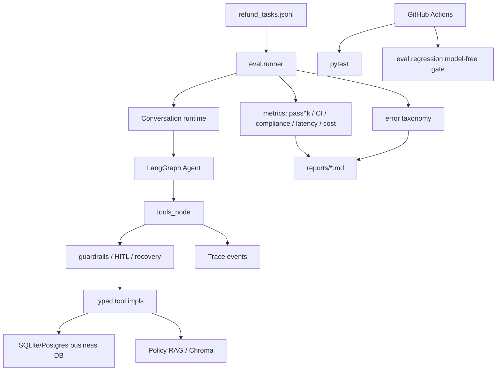

# 第 8 章：工程化实践

日期：2026-06-21

## 资料页码

- 资料第 178 页：工程化实践的目标是把 Agent 从“能跑”做成“可观测、可容错、可计费、可审计、可上线”。
- 资料第 180-181 页：模型路由、熔断、重试、自动降级需要配合使用；重试解决偶发失败，熔断防止雪崩，降级要可观测。
- 资料第 184-185 页：Token 成本控制要按租户、功能、模型、Agent 步骤统计，关注日均 token、P95 成本、异常飙升和预算封顶。
- 资料第 187-188 页：Agent 比传统服务更需要 Trace，因为执行路径依赖模型决策；必须记录工具、参数、耗时、模型、租户和错误。
- 资料第 190 页：安全工程要做工具权限控制、参数校验、两步授权、日志脱敏和审计日志，不能信任模型输出的工具调用。
- 资料第 192-193 页：部署要容器化、可回滚、可观测；金丝雀发布要关注错误率、P95 延迟、Token 成本、任务完成率、工具失败率和重试率。
- 资料第 197-198 页：Agent 评估要覆盖准确性、鲁棒性、效率和持续回归；LLM-as-judge 不能单独作为真相，要结合规则评分、人工抽检和对抗样本。
- 资料第 200 页：幻觉控制要通过 RAG grounding、结构化 Prompt、工具验证、事实核查和引用标注，不能只靠“请诚实回答”。
- 资料第 202 页：K8s/HPA 可以按 CPU、内存、请求队列、P95 延迟、429 比例等指标扩缩容，但要注意 LLM 长尾延迟。

## 本章目标

理解 RetailCare 的工程化不是“能启动一个 demo”，而是围绕六个验收闭环建立证据：

```text
真实业务规则
+ 端到端可运行
+ 可观测 Trace
+ 可恢复 Checkpoint/HITL
+ 可评测 Benchmark
+ 可回归 CI
```

这也是 RetailCare 最适合面试讲的地方：项目不只展示 Agent 能回答，而是证明它在高风险售后场景里可追踪、可评测、可恢复、可审计。

## 本章先补的工程缺口

这次没有直接写笔记，而是先把第 8 章暴露出来的工程问题改进到代码里。因为工程化实践 / Engineering Practice 的核心不是“能解释”，而是系统真的更稳、更可审计。

| 工程缺口 | 为什么是问题 | 本次代码修正 | 测试证据 |
| --- | --- | --- | --- |
| Trace 可能泄露 PII 或 secret | `/trace` 会暴露工具参数和用户输入，日志不能原样保存敏感信息 | `Trace.log()` 写入前统一 `_redact()` email、phone 和敏感 key，同时保留 `order_id` 等业务 ID | `tests/test_trace.py` |
| `policy_violation` 指标语义过宽 | 提前升级人工是体验/效率问题，不应和错误执行退款混成同一种政策违规 | 新增 `is_policy_violation()`，只把 forbidden state-changing writes 算成政策违规 | `tests/test_metrics.py` |
| API thread 可被跨用户复用 | 多轮售后任务有会话状态，thread_id 必须和 user_id 绑定 | `/chat` 复用同用户线程；跨用户复用返回 403；`/confirm` 也做 owner check | `tests/test_api.py` |
| 本地 `make test` 没有包含安全回归门 | 开发者本地测试如果只跑 pytest，可能漏掉 guardrail regression | `make test` 同时跑 pytest 和 `eval.regression`，并新增 `make regression` | `Makefile` |

这四个改动很适合作为面试里的“工程敏感度”例子：我不是只会把资料概念贴到项目上，而是能发现当前实现和生产要求之间的差距，并把差距变成代码、测试和流程。

## RetailCare 工程化地图

| 工程能力 | 中英对照 | RetailCare 证据 | 当前状态 |
| --- | --- | --- | --- |
| 服务化 | API Service | FastAPI `/chat`、`/confirm`、`/trace`、`/health` | 已有轻量服务，并做 thread reuse + same-user isolation |
| 可观测 | Observability / Trace | `TraceEvent` 记录 message/tool/decision/interrupt/error | 已有结构化 trace，并做基础 PII/secret redaction |
| 容错恢复 | Resilience / Recovery | `call_with_recovery()` + fault injection | 有 bounded retry + escalation |
| 可恢复任务 | Checkpoint / Resume | LangGraph `SqliteSaver` + `thread_id` | 支持 HITL 跨会话恢复 |
| 安全护栏 | Guardrails / HITL | `guard_write()` + interrupt + audit | 高风险写操作受控 |
| 评测闭环 | Evaluation Harness | `eval/runner.py`、`metrics.py`、reports | 有 pass^k、CI、合规指标 |
| 回归门 | Regression Gate | `eval/regression.py` + GitHub Actions + Makefile | 无模型安全门已接 CI 和本地 test |
| 成本观测 | Cost Accounting | `usage.snapshot()`、cost/task、Pareto | 已有 token/cost 统计 |
| 部署 | Deployment | Dockerfile、docker-compose、Makefile | 有容器化草案 |
| 标准化工具 | MCP / Tool Contract | Pydantic schema + MCP server | 已有 MCP 暴露 |

## 工程链路图



## 知识点卡片 1：从 Demo 到工程系统

知识点：工程化目标是可观测、可容错、可计费、可审计、可上线

中英对照：工程化实践 / Engineering Practice；生产就绪 / Production Readiness；可靠性闭环 / Reliability Loop

资料依据：资料第 178 页。

资料原意：Agent 从“能跑”到“能上线”，要补齐观测、容错、计费、审计和部署，不是只看一次回答是否正确。

RetailCare 例子：RetailCare 的北极星不是“聊天体验”，而是 evaluation-driven reliability system。项目验收明确写了 6 条闭环：业务规则、端到端可运行、trace、checkpoint/HITL、benchmark、CI。

具体场景：一个退款 demo 如果只展示“模型回答已退款”，并不能说明系统可靠。RetailCare 要证明：低额退款确认执行，高额/损坏升级人工，重复请求不二次退款，失败能降级，trace 可复盘，eval 能量化。

项目证据：

- `OPERATIONS_MANUAL.md` 第 32-45 行：定义 6 条最终验收闭环。
- `OPERATIONS_MANUAL.md` 第 47-57 行：给出 2026-06-16 的验收取证。
- `README.md` 第 23-25 行：展示 pass^k、policy_violation_rate、escalation_precision、cost/task。
- `ARCHITECTURE.md` 第 86-90 行：总结 enterprise closed-loop checks。

为什么这样设计：售后退款是真金白银的高风险业务。只要一次错误退款、重复退款或错误升级，就会造成损失或用户体验问题。因此项目必须以可证明的可靠性为中心。

替代方案：做一个更漂亮的聊天 UI，展示几个成功对话。

为什么暂时不选替代方案：UI 很重要，但不能替代工程证据。面试追问时，评测、trace、回归门比截图更能证明工程能力。

局限与后续扩展：当前仍是 mock 电商后端，不接真实支付/退款系统；生产化还需要真实鉴权、权限、队列、告警、灰度和审计保留策略。

面试表达：我把 RetailCare 做成了评测驱动的可靠性系统，而不是一个 demo chatbot。核心交付不是“能回答”，而是能用指标、trace 和 CI 证明它可靠、合规、可恢复。

## 知识点卡片 2：容错、重试和降级

知识点：工具失败时要可恢复，不能让模型编造

中英对照：重试 / Retry；指数退避 / Exponential Backoff；熔断 / Circuit Breaker；降级 / Graceful Degradation；故障注入 / Fault Injection

资料依据：资料第 180-181 页。

资料原意：重试处理偶发失败，熔断防止系统性故障扩散，降级在依赖不可用时保住核心体验。降级必须可观测，不能悄悄吞掉错误。

RetailCare 例子：`call_with_recovery()` 对 transient timeout/error 做 bounded retry。超过次数后返回结构化错误，提示 degrade gracefully and `escalate_to_human`。`faults.py` 可以注入 timeout/error/stale 来验证恢复路径。

具体场景：`get_order` 连续超时两次后恢复，系统继续处理；如果一直失败，系统不会猜订单状态，而是提示升级人工，不在不确定状态下执行退款。

项目证据：

- `src/retailcare/tools/recovery.py` 第 1-5 行：说明 bounded retry + graceful degradation。
- `src/retailcare/tools/recovery.py` 第 15-41 行：实现重试、give up、stale 标记。
- `src/retailcare/tools/faults.py` 第 1-6 行：故障注入用于证明 retry -> fallback -> escalate。
- `tests/test_faults.py` 第 17-39 行：覆盖 transient recover、permanent fault escalation、stale data。

为什么这样设计：Agent 的危险行为不是“工具失败”，而是“工具失败后模型硬编”。工程化恢复层把失败转成可处理信号，保护业务状态。

替代方案：直接抛异常，让上层统一 500。

为什么暂时不选替代方案：统一 500 会中断多轮任务，也无法引导 Agent 进入人工升级或安全兜底。

局限与后续扩展：当前是 bounded retry，没有真正的指数退避、熔断状态机、按工具分类的 timeout、重试间隔和下游健康检查。生产版应增加 per-tool retry policy 和 circuit breaker。

面试表达：我没有只做 happy path。RetailCare 通过 fault injection 测试工具失败，证明系统会重试、标记 stale、失败后升级人工，而不是让模型在未知状态下继续行动。

## 知识点卡片 3：全链路可观测性

知识点：Agent 路径动态，必须记录每一步模型、工具和决策

中英对照：可观测性 / Observability；轨迹 / Trace；结构化日志 / Structured Logging；链路追踪 / Tracing

资料依据：资料第 187-188 页。

资料原意：传统服务调用链较固定，Agent 路径由模型动态决定，分支多、偶现多。Trace 可以把“哪一步选了哪个工具、参数是什么、返回多长、错误在哪”串起来。

RetailCare 例子：`Trace` 记录 `message`、`tool_call`、`tool_result`、`tool_error`、`interrupt`、`decision`，并可保存为 JSON。FastAPI 也提供 `/trace/{session}` 给前端或调试查看。本章补充了基础脱敏：email、phone 和常见 secret key 在进入 trace 前被替换，但 `order_id` 这类业务定位 ID 保留。

具体场景：一次退款失败，不能只看最终回复。Trace 能显示模型有没有调用 `check_return_eligibility`、guardrail 是 block/confirm/escalate、工具结果是什么、用户是否确认、是否发生恢复降级。

项目证据：

- `src/retailcare/trace/logger.py` 第 1-6 行：trace 用于 Web UI 和 error taxonomy pipeline。
- `src/retailcare/trace/logger.py` 第 18-23 行：定义 email、phone 和敏感 key 的基础脱敏规则。
- `src/retailcare/trace/logger.py` 第 53-55 行：`Trace.log()` 先 JSON 化再脱敏。
- `src/retailcare/trace/logger.py` 第 94-107 行：递归脱敏 dict/list/string。
- `src/retailcare/api/app.py` 第 68-77 行：API payload 返回 tools 和 summary。
- `src/retailcare/api/app.py` 第 92-97 行：`GET /trace/{session}` 返回结构化 trace。
- `tests/test_trace.py`：验证 email、phone、api_key、authorization 被脱敏，同时保留 `order_id`。

为什么这样设计：Agent 错误通常是链路错误，不是单个函数错误。没有 trace，就很难区分是 prompt、工具选择、参数、政策、guardrail 还是下游失败。

替代方案：只记录最终用户输入和最终回答。

为什么暂时不选替代方案：最终问答日志无法支持 action-level compliance，也无法做错误分类和回归定位。

局限与后续扩展：当前已有基础 redaction，但还不是完整数据治理。真实生产需要可配置 PII 规则、租户级保留策略、采样策略、跨服务 trace_id、OpenTelemetry、Loki/ELK 和不可篡改审计存储。

面试表达：RetailCare 的 trace 是步骤级的，不只是请求日志。每次工具调用、结果、错误、HITL 中断和 guardrail 决策都会记录，支撑 UI 展示、错误分类和复盘。

## 知识点卡片 4：Token 成本与质量成本评估

知识点：Agent 成本要按任务、模型和步骤统计

中英对照：Token 成本 / Token Cost；成本监控 / Cost Monitoring；质量成本前沿 / Quality-Cost Pareto；P95 成本 / P95 Cost

资料依据：资料第 184-185 页。

资料原意：Agent 多轮、多工具，context 会膨胀，成本要按租户、功能、模型、步骤监控。常见优化包括摘要、缓存、小模型路由、Batch API、输出限制和预算封顶。

RetailCare 例子：`config.py` 中 `_Usage` 累计 calls、prompt_tokens、completion_tokens、cost_usd；`eval/common.py` 每个 task-run 记录 cost_usd；`metrics.py` 输出 cost_per_task；`pareto.py` 比较 weak/strong model 的质量和成本。

具体场景：在 32 个任务基线报告中，RetailCare 记录总调用数 286、prompt_tokens 521268、completion_tokens 51889、cost_usd 0.167748；报告还给出 cost/task 0.001747。

项目证据：

- `src/retailcare/config.py` 第 72-98 行：usage accumulator。
- `eval/common.py` 第 30-62 行：记录单任务前后 usage 差值，形成 cost_usd。
- `eval/metrics.py` 第 68-85 行：计算 latency_p95 和 cost_per_task_usd。
- `reports/baseline_report.md` 第 3-8 行：展示 pass^k、延迟、成本、token usage。
- `reports/pareto_report.md` 第 5-21 行：展示 DeepSeek v4 flash/pro 的质量 x 成本结果和 caveat。

为什么这样设计：成本不是上线后才看的账单问题，而是架构选择的一部分。多 Agent、RAG、强模型、长上下文都会改变 cost/task。

替代方案：只用最强模型，不统计 token。

为什么暂时不选替代方案：最强模型不一定对所有任务划算；不统计成本就无法判断 guardrail、RAG、多 Agent 或模型路由是否值得。

局限与后续扩展：当前 Pareto 报告诚实说明价格使用 placeholder，反映 token volume 不是准确真实美元成本。后续要接真实价格、多租户预算和告警。

面试表达：我从第一天就在 eval 里记录 token 和 cost/task。这样架构选择不是“哪个模型更强”，而是质量、成本、延迟和合规的 Pareto 取舍。

## 知识点卡片 5：安全、权限和审计

知识点：永远不信任模型输出的工具调用

中英对照：工具权限 / Tool Authorization；两步授权 / Two-step Authorization；人在回路 / HITL；审计日志 / Audit Log；数据脱敏 / Redaction

资料依据：资料第 190 页。

资料原意：工具调用要做白名单、参数校验、SQL 参数化、权限检查、两步授权、日志脱敏和审计。模型提议不等于可以执行。

RetailCare 例子：写工具 `create_return_request` 和 `issue_compensation` 会先经过 `guard_write()`，做必填字段、idempotency_key、退货资格、金额阈值和人工升级判断。低风险确认，高风险升级，明显不合规 block。本章还修正了指标语义：`policy_violation` 只统计错误执行 forbidden state-changing writes，不把提前升级人工误报为政策违规。

具体场景：用户要求退 $201 的显示器或 defective laptop，即使模型想创建退款，guardrail 也会返回 `escalate`，不允许自动写库。

项目证据：

- `src/retailcare/graph/guardrails.py` 第 1-8 行：明确 allow/confirm/escalate/block。
- `src/retailcare/graph/guardrails.py` 第 42-71 行：退货和补偿写操作的规则校验。
- `src/retailcare/graph/runtime.py` 第 76-86 行：HITL confirm/resume。
- `eval/common.py` 第 13-31 行：定义 `POLICY_WRITE_ACTIONS` 和 `is_policy_violation()`。
- `eval/regression.py` 第 16-55 行：12 个 model-free guardrail regression cases。
- `tests/test_metrics.py`：验证 `create_return_request`、`issue_compensation` 是政策违规范围，`escalate_to_human` 不是。
- `.github/workflows/ci.yml` 第 25-30 行：CI 每次跑 eval-regression gate。

为什么这样设计：售后写操作会改变业务状态，不能只靠 prompt 约束。后端策略必须有最终执行权。

替代方案：只在 system prompt 里要求“高价值退款不要自动执行”。

为什么暂时不选替代方案：Prompt 会失效或被注入绕过。工程上必须把关键规则放到代码和测试里。

局限与后续扩展：当前已有基础 trace redaction 和 API thread owner check，但还没有完整用户鉴权、租户权限、user/order ownership、role/tenant check 和不可篡改审计存储。

面试表达：我的安全设计是“模型建议，后端批准”。RetailCare 的写操作必须经过 schema、policy guardrail、HITL、幂等和审计，CI 还会防止关键规则回归。

## 知识点卡片 6：评测与回归

知识点：Agent 评估要覆盖准确性、鲁棒性、效率和持续回归

中英对照：评测体系 / Evaluation Harness；任务成功率 / Task Success Rate；一致性 / Consistency；pass^k；置信区间 / Confidence Interval；回归测试 / Regression Test

资料依据：资料第 197-198 页。

资料原意：没有度量就没有优化。Agent 评估要覆盖对不对、稳不稳、快不快、贵不贵，并结合线上真实分布持续回归。LLM-as-judge 有偏差，应和规则评分、人工抽检结合。

RetailCare 例子：`eval/runner.py` 从 `refund_tasks.jsonl` 加载任务，多 run 后输出 pass^k、CI、compliance、error taxonomy、usage。`eval/regression.py` 是无模型安全门，适合 CI 和本地 `make test` 每次跑。

具体场景：一次退款任务是否成功，不看模型口头说得好不好，而看 expected_actions 是否被调用、forbidden_actions 是否没发生、是否错误执行了 forbidden 写操作、是否不必要升级、延迟和成本是多少。

项目证据：

- `eval/datasets/refund_tasks.jsonl`：32 条动作级任务。
- `eval/common.py` 第 34-70 行：单次任务运行记录 expected/missing/violated/called/cost/latency。
- `eval/common.py` 第 29-31 行：把 policy violation 限定为 forbidden 写操作，避免指标误伤。
- `eval/runner.py` 第 28-48 行：多次运行并聚合 pass^k、合规、错误分类和 usage。
- `eval/metrics.py` 第 20-65 行：pass^k 和 Wilson CI。
- `eval/metrics.py` 第 68-85 行：policy_violation、handoff、latency、cost。
- `eval/judge.py` 第 1-3 行：LLM judge 只是初筛，action-level rule eval 仍是 primary。

为什么这样设计：Agent 输出具有随机性，单次 pass@1 容易误判。pass^k 能衡量一致性，CI 能表达小样本不确定性，错误分类能指导下一步优化。

替代方案：人工看几条聊天记录，或者只用 LLM-as-judge 打分。

为什么暂时不选替代方案：人工抽检有价值，但不能替代自动回归；LLM judge 可能偏好冗长、格式讨好或和被测模型同偏。

局限与后续扩展：当前任务集是自建 mock 售后任务，规模还小；生产应加入真实采样、人工校准、更多语言/边界/注入用例和线上指标对齐。

面试表达：RetailCare 的评测是动作级的。每条任务有 expected/forbidden actions，系统跑出 pass^k、CI、违规率、升级精度、延迟和成本，并用错误分类指导迭代。

## 知识点卡片 7：CI 与安全回归门

知识点：高风险规则要进入无模型回归测试

中英对照：持续集成 / Continuous Integration, CI；回归门 / Regression Gate；无模型测试 / Model-free Test；安全决策基线 / Safety Baseline

资料依据：资料第 198 页。

资料原意：Agent 回归测试集应覆盖主路径、典型失败、工具错误、长上下文、多语言等，每条用例包含输入、期望工具或答案要点、不可出现项，并与 CI 集成。

RetailCare 例子：GitHub Actions 在每次 push/PR 上跑 ruff、pytest 和 `eval.regression`。本章还把 `eval.regression` 加进本地 `make test`，并新增 `make regression`。`eval.regression` 不调用模型，只验证 guardrail 对关键退款/补偿案例的决策没有变。

具体场景：如果有人改坏 RET-003，让 $201 退款不再升级人工，`eval.regression` 会失败，CI 变红。

项目证据：

- `.github/workflows/ci.yml` 第 20-30 行：lint、pytest、eval-regression gate。
- `Makefile` 第 12-17 行：本地 `make test` 同时跑 pytest 和 model-free regression，`make regression` 可单独运行安全门。
- `eval/regression.py` 第 17-28 行：覆盖低额、边界金额、高额、defective、gift card、perishable、out-of-window、not delivered。
- `eval/regression.py` 第 42-55 行：补偿阈值 regression cases 和 baseline held 输出。
- 本章验证中 `eval.regression` 输出 12 个安全决策全通过。

为什么这样设计：真实模型评测昂贵、慢、需要密钥，不适合每次 CI 必跑。关键安全规则可以做成 deterministic gate。

替代方案：每次 CI 都跑完整模型 eval。

为什么暂时不选替代方案：完整 eval 成本高、时间长、依赖外部模型稳定性；更适合 nightly 或 release gate。PR 级别先跑无模型安全门。

局限与后续扩展：CI 目前不跑真实模型 eval，也没有 Docker build/push、部署环境 smoke test。后续可加 gated job，需要 secret 才跑。

面试表达：我的 CI 不只是跑单元测试，还跑 model-free eval regression。这样即使没有模型密钥，也能在每次提交时拦住退款政策回归。

## 知识点卡片 8：部署与运维

知识点：Agent 服务要容器化、可回滚、可扩缩、可观测

中英对照：部署 / Deployment；Docker 容器化 / Containerization；Compose；健康检查 / Health Check；灰度发布 / Canary Release

资料依据：资料第 192-193、202 页。

资料原意：Agent 服务应作为标准服务或 Job 部署；金丝雀发布关注错误率、P95 延迟、Token 成本、任务完成率、工具失败率、重试率；K8s HPA 可按 CPU、内存、队列、P95、429 等扩缩容。

RetailCare 例子：项目有 Dockerfile、docker-compose、FastAPI `/health`、Makefile 命令。Compose 提供 Postgres 和 Chroma，app profile 可连依赖运行。API 层本章补了会话工程：同一 user/thread 复用 Conversation，不同 user 不能复用同一个 thread。

具体场景：本地开发可用 SQLite + embedded Chroma；部署验证可 `docker compose --profile full up`，服务暴露 8080，Postgres 有 healthcheck。多轮客服场景下，用户第二条消息带同一个 `thread_id` 会进入同一条任务轨迹；另一个用户冒用这个 `thread_id` 会得到 403。

项目证据：

- `Dockerfile` 第 1-14 行：Python 3.12 slim、安装 pinned deps、暴露 8080、uvicorn 启动。
- `docker-compose.yml` 第 1-24 行：Postgres 和 Chroma。
- `docker-compose.yml` 第 25-38 行：app 使用 DATABASE_URL、CHROMA_HOST、env_file、8080。
- `src/retailcare/api/app.py` 第 43-65 行：thread owner check、chat thread reuse、confirm resume。
- `src/retailcare/api/app.py` 第 80-102 行：`/chat`、`/confirm`、`/trace` 和 `/health`。
- `Makefile` 第 7-32 行：setup/test/lint/ping/eval/serve/demo。
- `tests/test_api.py`：验证同用户 thread 复用、跨用户 thread 403、confirm resume 复用。

为什么这样设计：工程化交付需要复现路径。Makefile 面向开发，Docker/Compose 面向部署和依赖编排，FastAPI 面向服务调用。

替代方案：只提供“python main.py”脚本。

为什么暂时不选替代方案：单脚本不利于环境复现、依赖启动、CI 和服务化部署。

局限与后续扩展：当前没有 Kubernetes manifests、Helm、HPA、金丝雀、自动回滚、生产 secrets 管理和真实监控告警。Docker 层也未在本轮重新 build 验证。

面试表达：RetailCare 不是只在 notebook 里跑。我提供了 FastAPI、Dockerfile、Compose、Makefile 和 CI。生产化还会补 K8s、灰度和监控，但基本服务化路径已经具备。

## 工程化验收表

| 验收问题 | RetailCare 当前答案 | 证据 |
| --- | --- | --- |
| 业务规则真实吗 | 有版本化售后规则和 guardrail | `BUSINESS_RULES.md`, `guardrails.py` |
| 能端到端跑吗 | 有 demo、CLI、API、Web | `Makefile`, `api/app.py`, `demo.py` |
| 能复盘吗 | 有结构化 trace，并做基础脱敏 | `trace/logger.py`, `/trace/{session}`, `tests/test_trace.py` |
| 能恢复吗 | HITL + checkpoint + thread_id | `runtime.py`, `tests/test_hitl.py` |
| 能评测吗 | 32 任务 eval + pass^k + 更准确的 policy_violation 语义 | `eval/runner.py`, `eval/common.py`, `reports/baseline_report.md` |
| 能防回归吗 | pytest + eval.regression + GitHub Actions + Makefile | `.github/workflows/ci.yml`, `Makefile` |
| 能控成本吗 | usage + cost/task + Pareto | `config.py`, `pareto_report.md` |
| 能部署吗 | Docker + Compose + FastAPI health + thread owner check | `Dockerfile`, `docker-compose.yml`, `api/app.py` |

## 本章验证

命令：

```bash
make test
```

结果：

```text
44 passed
baseline held — 12 safety decisions correct
```

说明：

- pytest 覆盖 API session/thread、trace redaction、metrics、fault recovery、HITL、tools、MCP、memory。
- `eval.regression` 是无模型安全门，验证退款/补偿关键 guardrail 决策。
- 本章没有运行真实模型 eval，也没有重新 build Docker 镜像；这些属于需要外部模型密钥或本机 Docker 环境的验证。

## 面试版总结

如果面试官问“你的 Agent 项目工程化体现在哪里”，可以这样回答：

```text
RetailCare 不是一个只会聊天的 demo，而是按生产可靠性目标设计的售后 Agent 系统。

第一，我做了结构化工具层和 guardrail，高风险写操作必须经过政策校验、HITL、幂等和审计。
第二，我做了 trace，每次工具调用、结果、错误、中断和决策都能复盘，并补了基础 PII/secret 脱敏。
第三，我做了 fault injection 和 recovery，验证工具 timeout/error/stale 时能重试、降级和升级人工。
第四，我做了 eval harness，32 条自建售后任务按 expected/forbidden actions 评估，输出 pass^k、CI、违规率、升级精度、延迟和成本；其中 policy_violation 只统计错误写操作，避免指标语义混乱。
第五，我做了 model-free regression gate，把关键退款政策写成 CI 和本地 Makefile 安全门，每次提交都跑，不依赖模型密钥。
第六，我提供了 FastAPI、Dockerfile、docker-compose、Makefile 和健康检查，并在 API 层补了 thread 复用与跨用户隔离，具备服务化交付路径。

所以这个项目的重点不是“调通模型”，而是让 Agent 可追踪、可评测、可恢复、可回归。
```

## 下一章预告

第 9 章会学习 Prompt 工程 / Prompt Engineering。重点问题是：

```text
RetailCare 的 prompt 如何约束工具使用、政策合规、澄清问题和注入防御?
```

我们会比较 `SYSTEM_L0` 和 `SYSTEM_RAG`，并逐条检查：哪些 prompt 规则只是提示，哪些已经被代码、schema、guardrail、HITL 和 regression tests 兜住。
